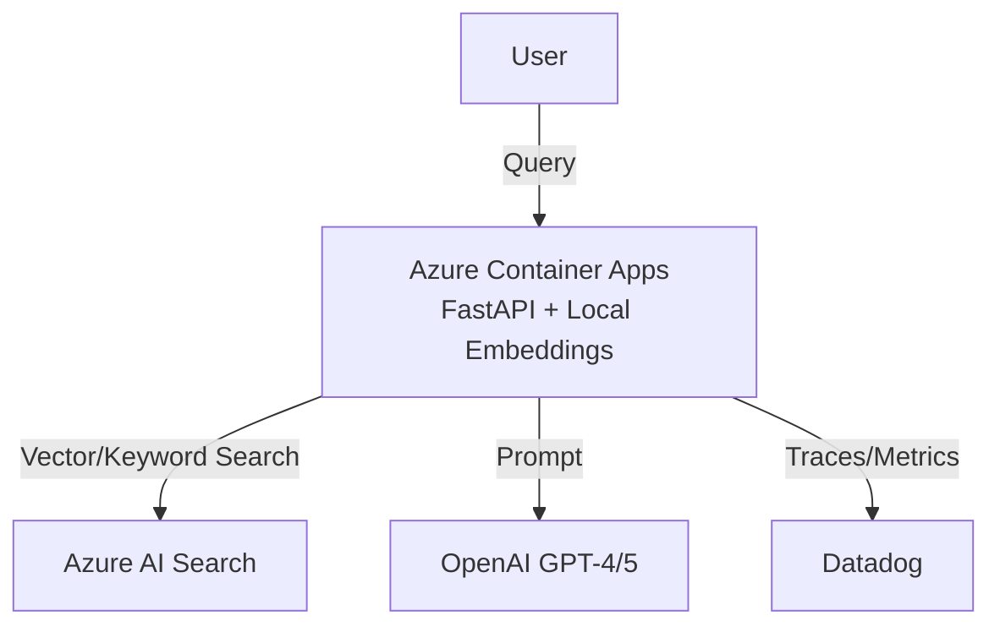

# Serverless RAG API

[English](#english) | [中文](#中文) | [日本語](#日本語)

## Project Structure

```text
├── app/
│   ├── __init__.py                        # Package version
│   ├── main.py                            # FastAPI application + Datadog JSON logging
│   ├── embed.py                           # Sentence-transformers embedding (384-dim)
│   └── search_client.py                   # Azure AI Search client factory
├── scripts/
│   ├── create_index.py                    # Create Azure AI Search index (HNSW)
│   ├── ingest.py                          # Document ingestion (PDF/MD/TXT → chunks)
│   ├── clear_index.py                     # Clear all documents from index
│   ├── deploy_canary.sh                   # Canary rollout logic (0→10→50→100%)
│   ├── setup-azure.sh                     # Azure infrastructure provisioning
│   ├── test_api.py                        # API smoke test
│   ├── sync_datadog_catalog.sh            # Datadog Service Catalog sync
│   └── send_datadog_dora_deployment.sh    # Datadog DORA deployment event
├── .github/workflows/
│   ├── ci.yml                             # Build → Trivy → SBOM → Cosign → GHCR
│   ├── cd.yml                             # Canary Deploy → ACA → DORA Metrics
│   └── security.yml                       # Trivy vulnerability scan (PR gate)
├── data/                                  # Source documents (PDF/MD/TXT)
├── service.datadog.yaml                   # Datadog Service Catalog metadata
├── Dockerfile                             # Multi-stage build (ddtrace-run)
└── requirements.txt
```

---

<a id="english"></a>
## English

### What problem / Why
Running RAG applications often incurs high recurring costs for embedding APIs and requires managing complex infrastructure. This project provides a cost-optimized, serverless RAG architecture by running `sentence-transformers` locally within Azure Container Apps, combined with a CI/CD pipeline for zero-downtime deployments.

### Architecture


### CI/CD Pipeline
- **Triggers**: Push to `main` branch (CI/CD), Pull Requests (Security Scan).
- **Artifacts**: Docker image pushed to GitHub Container Registry (GHCR), SBOM (CycloneDX format), Cosign signature.
- **Tags**: Images are tagged with the Git commit SHA (`sha-<short_sha>`).
- **Deployment Strategy**: Canary rollout (0% → 10% → 50% → 100%) on Azure Container Apps with automated health checks and rollback.

### Security
- **Permissions**: Uses least-privilege GitHub Actions `permissions` (e.g., `id-token: write` for OIDC, `packages: write` for GHCR).
- **OIDC**: Keyless authentication with Azure via OIDC (`azure/login`), eliminating long-lived credentials.
- **Scanning & SBOM**: Trivy scans the filesystem on PRs and the built image in CI. Syft generates an SBOM, which is attached to the image registry. Cosign signs the image keylessly.

### Runbook
- **Run Locally**:
  ```bash
  uv venv && source .venv/bin/activate
  uv pip install -r requirements.txt
  cp .env.example .env # Fill in required variables
  uvicorn app.main:app --reload
  ```
- **Deploy**:
  Push to the `main` branch to trigger the `.github/workflows/cd.yml` workflow. The pipeline handles provisioning and traffic shifting automatically.
- **Rollback**:
  If the canary health check fails, the CD pipeline automatically halts and traffic remains on the previous revision. To manually rollback, revert the commit on `main` or use the Azure CLI to shift 100% traffic to the previous revision:
  `az containerapp ingress traffic set -n <app-name> -g <rg> --revision <prev-rev>=100`

### Lessons Learned / Trade-offs
- **Local Embeddings vs. API**: Running `sentence-transformers` locally saves API costs but increases the container image size and memory footprint. The `all-MiniLM-L6-v2` model was selected to strike a balance between accuracy and resource usage.
- **Serverless Cold Starts**: Azure Container Apps scale to zero, which is great for cost, but loading the embedding model into memory during a cold start adds latency. This is mitigated by setting a minimum replica count of 1 for production environments.
- **Canary Complexity**: Implementing canary deployments requires careful state management of ACA revisions. A bash script (`deploy_canary.sh`) was chosen over complex operators to keep the pipeline transparent and easy to debug.

---

<a id="中文"></a>
## 中文

### 解决什么问题 / 为什么
运行 RAG 应用通常会产生高昂的 Embedding API 持续调用成本，且需要管理复杂的基础设施。本项目通过在 Azure Container Apps 中本地运行 `sentence-transformers`，提供了一个成本优化的 Serverless RAG 架构，并结合了 CI/CD 流水线以实现零停机部署。

### CI/CD 流水线
- **触发条件**: 推送至 `main` 分支触发完整 CI/CD；提交 Pull Request 触发安全扫描。
- **产物**: 推送至 GHCR 的 Docker 镜像、SBOM (CycloneDX 格式)、Cosign 签名。
- **Tag 策略**: 镜像使用 Git Commit SHA 作为标签 (`sha-<short_sha>`)。
- **部署策略**: 在 Azure Container Apps 上执行金丝雀发布 (0% → 10% → 50% → 100%)，包含自动健康检查与回滚机制。

### 安全性
- **权限控制**: GitHub Actions 采用最小权限原则 (`permissions`)，例如使用 `id-token: write` 获取 OIDC token，`packages: write` 推送镜像。
- **OIDC**: 通过 OIDC (`azure/login`) 与 Azure 进行无密钥认证，避免硬编码长期凭证。
- **扫描与 SBOM**: PR 阶段使用 Trivy 扫描文件系统，CI 阶段扫描构建好的镜像。使用 Syft 生成 SBOM 并附加到镜像仓库，最后通过 Cosign 进行无密钥签名。

### 运维手册 (Runbook)
- **本地运行**:
  ```bash
  uv venv && source .venv/bin/activate
  uv pip install -r requirements.txt
  cp .env.example .env # 填入必要的环境变量
  uvicorn app.main:app --reload
  ```
- **一键部署**:
  将代码推送到 `main` 分支即可触发 `.github/workflows/cd.yml` 流水线，自动完成构建、部署和流量切换。
- **如何回滚**:
  如果金丝雀部署的健康检查失败，CD 流水线会自动中止，流量将保持在旧版本。若需手动回滚，可 Revert `main` 分支的 commit，或使用 Azure CLI 将 100% 流量切回上一版本：
  `az containerapp ingress traffic set -n <app-name> -g <rg> --revision <prev-rev>=100`

### 经验教训与权衡
- **本地 Embedding vs API 调用**: 本地运行 `sentence-transformers` 节省了 API 成本，但增加了容器镜像体积和内存占用。架构中采用了 `all-MiniLM-L6-v2` 模型，以在准确率和资源消耗之间取得平衡。
- **Serverless 冷启动**: Azure Container Apps 支持缩容到 0，有利于节省成本，但冷启动时将 Embedding 模型加载到内存会增加延迟。在生产环境中，通过将最小副本数设置为 1 来缓解此问题。
- **金丝雀发布的复杂性**: 实现金丝雀发布需要仔细管理 ACA 的版本状态。方案中选择使用 Bash 脚本 (`deploy_canary.sh`) 而不是复杂的 Operator，以保持流水线的透明度和易于调试。

---

<a id="日本語"></a>
## 日本語

### 解決する課題 / 背景
RAGアプリケーションの運用には、Embedding APIの継続的なコストと複雑なインフラ管理が伴います。本プロジェクトは、Azure Container Apps内で`sentence-transformers`をローカル実行することでコストを最適化したサーバーレスRAGアーキテクチャを提供し、ゼロダウンタイムデプロイのためのCI/CDパイプラインを組み合わせています。

### CI/CD パイプライン
- **トリガー**: `main`ブランチへのPush（CI/CD）、Pull Request（セキュリティスキャン）。
- **成果物**: GHCRにプッシュされたDockerイメージ、SBOM（CycloneDX形式）、Cosign署名。
- **Tag 戦略**: GitコミットSHA（`sha-<short_sha>`）をイメージタグとして使用。
- **デプロイ戦略**: Azure Container Appsでのカナリアリリース（0% → 10% → 50% → 100%）。自動ヘルスチェックとロールバック機能付き。

### セキュリティ
- **権限管理**: 最小権限のGitHub Actions `permissions`を使用（例：OIDC用の`id-token: write`、GHCR用の`packages: write`）。
- **OIDC**: OIDC（`azure/login`）を介したAzureとのキーレス認証。長期的なクレデンシャルを排除。
- **スキャンと SBOM**: PR時にTrivyでファイルシステムをスキャンし、CIでビルド済みイメージをスキャン。SyftでSBOMを生成してイメージレジストリに添付。Cosignでイメージにキーレス署名。

### 運用マニュアル (Runbook)
- **ローカル実行**:
  ```bash
  uv venv && source .venv/bin/activate
  uv pip install -r requirements.txt
  cp .env.example .env # 必要な環境変数を入力
  uvicorn app.main:app --reload
  ```
- **ワンクリックデプロイ**:
  `main`ブランチにプッシュすると`.github/workflows/cd.yml`がトリガーされ、ビルド、デプロイ、トラフィック移行が自動的に処理されます。
- **ロールバック方法**:
  カナリアリリースのヘルスチェックが失敗した場合、CDパイプラインは自動的に停止し、トラフィックは旧リビジョンに維持されます。手動でロールバックするには、`main`のコミットをRevertするか、Azure CLIを使用してトラフィックを100%旧リビジョンに戻します：
  `az containerapp ingress traffic set -n <app-name> -g <rg> --revision <prev-rev>=100`

### 得られた知見とトレードオフ
- **ローカル Embedding vs API 呼び出し**: `sentence-transformers`のローカル実行はAPIコストを削減しますが、コンテナイメージのサイズとメモリ使用量が増加します。精度とリソース消費のバランスを取るため、`all-MiniLM-L6-v2`モデルを採用しています。
- **Serverless コールドスタート**: Azure Container Appsはゼロスケールに対応しておりコスト面で有利ですが、コールドスタート時にEmbeddingモデルをメモリにロードするためレイテンシが増加します。緩和策として、本番環境では最小レプリカ数を1に設定しています。
- **カナリアリリースの複雑さ**: カナリアリリースの実装にはACAリビジョンの状態管理が必要です。パイプラインの透明性とデバッグのしやすさを保つため、複雑なOperatorではなくBashスクリプト（`deploy_canary.sh`）を採用しています。
