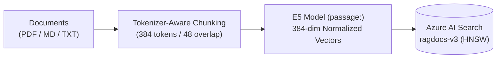
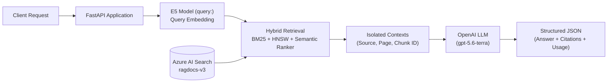
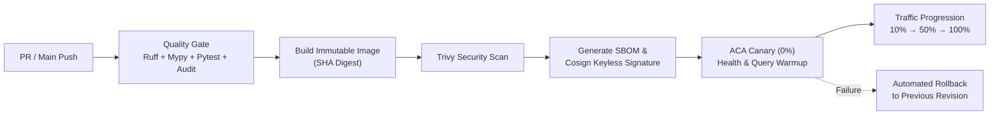
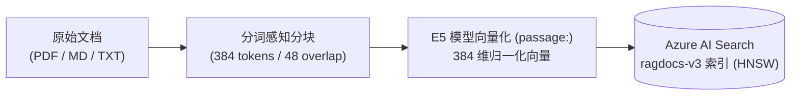
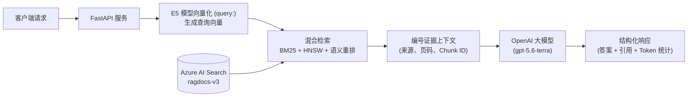
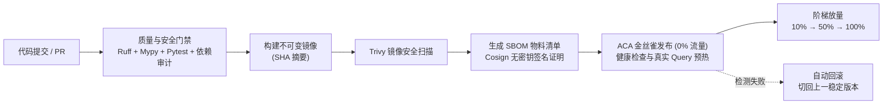
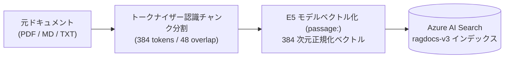
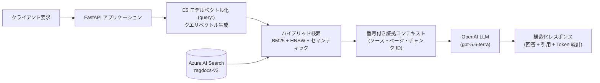
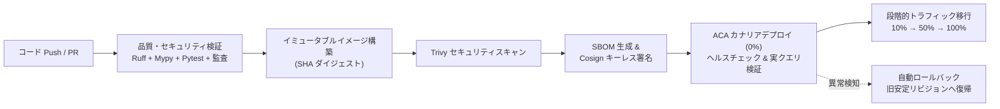

# Serverless Multilingual RAG on Azure

[](https://github.com/workHMZ/aca-ghcr-cicd-lab/actions/workflows/ci.yml)
[](https://github.com/workHMZ/aca-ghcr-cicd-lab/actions/workflows/security.yml)
[](https://www.python.org/)
[](#configuration)

Production-ready, cost-optimized serverless multilingual Retrieval-Augmented Generation (RAG) service on Azure Container Apps, powered by local multilingual embeddings, Azure AI Search hybrid retrieval, and OpenAI Structured Outputs.

[English](#english) | [中文](#中文) | [日本語](#日本語)

---

## Project Structure

```text
├── app/
│   ├── config.py                          # Validated Pydantic runtime settings
│   ├── chunking.py                        # Tokenizer-aware overlapping chunking
│   ├── embed.py                           # Pinned E5 query/passage embeddings (384-dim)
│   ├── search_client.py                   # Cached Azure AI Search client
│   └── main.py                            # Async FastAPI + Datadog APM + Structured generation
├── eval/
│   ├── corpus.jsonl                       # Synthetic multilingual evaluation corpus
│   └── golden.jsonl                       # Labelled multi-lingual retrieval ground truth
├── scripts/
│   ├── create_index.py                    # Azure AI Search versioned index creation (HNSW + Semantic)
│   ├── ingest.py                          # Document ingestion (PDF/MD/TXT → chunks → embeddings)
│   ├── clear_index.py                     # Safe document purging by source prefix
│   ├── evaluate_retrieval.py              # Offline retrieval evaluation (Recall@K, MRR)
│   ├── deploy_canary.sh                   # Progressive ACA canary rollout & automated rollback
│   ├── test_api.py                        # API smoke testing
│   ├── verify.sh                          # Local quality gate (Ruff, Mypy, pip-audit, Pytest)
│   ├── sync_datadog_catalog.sh            # Datadog Service Catalog sync
│   └── send_datadog_dora_deployment.sh    # Datadog DORA deployment tracking
├── .github/workflows/
│   ├── ci.yml                             # Quality gates → Immutable image → SBOM → Cosign signature
│   ├── cd.yml                             # Verification → Canary deployment → Automated rollback
│   └── security.yml                       # Pull Request filesystem, secret & dependency scanning
├── terraform/                             # Azure Container Apps & Search infrastructure as code
├── data/                                  # Source knowledge documents
├── service.datadog.yaml                   # Datadog Service Catalog metadata
└── pyproject.toml                         # Unified project configuration & dependencies
```

---

<a id="english"></a>

## English

### Overview & Core Value

Building production RAG systems often introduces high recurring embedding API costs, unpredictable retrieval across languages, and complex deployment lifecycles. 

This project provides a cost-effective, enterprise-grade multilingual Serverless RAG solution:
- **Local Multilingual Embeddings**: Runs `multilingual-e5-small` in-container with asymmetric `query:` / `passage:` prefixes and L2 normalization, eliminating per-query embedding API costs and boosting multilingual recall.
- **Hybrid Retrieval**: Combines keyword search, HNSW dense vectors, and Azure AI Search Semantic Ranker for high-precision context retrieval.
- **Grounded Structured Outputs**: Uses OpenAI Responses API to enforce structured JSON responses with validated citations and context isolation.
- **Supply Chain Security & Canary Release**: Automated CycloneDX SBOM generation, Trivy vulnerability scanning, Cosign keyless signing, and progressive canary rollouts (0% → 10% → 50% → 100%) on Azure Container Apps.
- **Offline Quality Evaluation**: Built-in retrieval evaluation framework measuring Recall@K and MRR across English, Chinese, and Japanese.

---

### End-to-End Pipelines

#### 1. Data Ingestion Pipeline

```mermaid
flowchart LR
    Docs["Documents<br/>(PDF / MD / TXT)"] --> Chunk["Tokenizer-Aware Chunking<br/>(384 tokens / 48 overlap)"]
    Chunk --> Embed["E5 Model (passage:)<br/>384-dim Normalized Vectors"]
    Embed --> Index[("Azure AI Search<br/>ragdocs-v3 (HNSW)")]
```

#### 2. Online Query Pipeline

```mermaid
flowchart LR
    Client["Client Request"] --> API["FastAPI Application"]
    API --> QVec["E5 Model (query:)<br/>Query Embedding"]
    QVec --> Hybrid["Hybrid Retrieval<br/>BM25 + HNSW + Semantic Ranker"]
    Index[("Azure AI Search<br/>ragdocs-v3")] --> Hybrid
    Hybrid --> Context["Isolated Contexts<br/>(Source, Page, Chunk ID)"]
    Context --> LLM["OpenAI LLM<br/>(gpt-5.6-terra)"]
    LLM --> Response["Structured JSON<br/>(Answer + Citations + Usage)"]
```

#### 3. Secure CI/CD Canary Pipeline

```mermaid
flowchart LR
    PR["PR / Main Push"] --> Lint["Quality Gate<br/>Ruff + Mypy + Pytest + Audit"]
    Lint --> Build["Build Immutable Image<br/>(SHA Digest)"]
    Build --> Scan["Trivy Security Scan"]
    Scan --> SBOM["Generate SBOM &<br/>Cosign Keyless Signature"]
    SBOM --> Canary["ACA Canary (0%)<br/>Health & Query Warmup"]
    Canary --> Promote["Traffic Progression<br/>10% → 50% → 100%"]
    Canary -. "Failure" .-> Rollback["Automated Rollback<br/>to Previous Revision"]
```

---

### Key Features

1. **Multilingual Hybrid Retrieval**
   - Fixed model revision: `intfloat/multilingual-e5-small` (`614241f...`).
   - Token-aware chunking preserving page metadata, content hashes, and document lineage.
   - Azure AI Search index (`ragdocs-v3`) with cosine HNSW and semantic ranking.
2. **Grounded Synthesis & Safety**
   - Retrieved chunks wrapped inside untrusted evidence boundaries.
   - Pydantic schema validation for structured answers, citations, and groundedness flags.
3. **Observability & DORA Metrics**
   - Datadog APM tracing (`ddtrace`), structured JSON logging, and Service Catalog integration.
   - Automated deployment event emission for tracking lead time and deployment frequency.
4. **Offline Evaluation Framework**
   - Synthetic benchmark fixture (`eval/corpus.jsonl`, `eval/golden.jsonl`) to evaluate retrieval quality independently from LLM generation.

---

### Runbook

#### 1. Local Setup
```bash
# Install dependencies with locked environment
uv sync --frozen --dev

# Configure environment variables
cp .env.example .env
# Edit .env and supply AZURE_SEARCH_ENDPOINT, AZURE_SEARCH_API_KEY, OPENAI_API_KEY
```

#### 2. Index Management & Data Ingestion
```bash
# Create versioned Azure AI Search index
uv run python scripts/create_index.py --index-name ragdocs-v3

# Ingest local documents from data/
uv run python scripts/ingest.py --data-dir data --index-name ragdocs-v3
```

#### 3. Run Locally & Probe API
```bash
# Start FastAPI application
uv run uvicorn app.main:app --host 127.0.0.1 --port 8000

# Probe health & readiness
curl -fsS http://127.0.0.1:8000/health
curl -fsS http://127.0.0.1:8000/ready

# Test query endpoint
curl -fsS http://127.0.0.1:8000/query \
  -H 'Content-Type: application/json' \
  --data '{"question": "How does HashMap handle collisions in Java 8?", "top_k": 3}'
```

#### 4. Run Offline Retrieval Evaluation
```bash
# Run local model comparison against synthetic golden fixture
uv run python scripts/evaluate_retrieval.py \
  --backend local \
  --model sentence-transformers/all-MiniLM-L6-v2 --revision 1110a243fdf4706b3f48f1d95db1a4f5529b4d41 \
  --model intfloat/multilingual-e5-small --revision 614241f622f53c4eeff9890bdc4f31cfecc418b3
```

`--backend local` reads only `eval/corpus.jsonl` and `eval/golden.jsonl` and runs model
inference on the CPU — no Azure resources, credentials, or index are required. Repeat
`--revision` once for every `--model`, or omit all revisions.

Result on the bundled fixture (9 passages, 6 queries, 2 each in `en` / `ja` / `zh`):

| Model | Recall@1 | Recall@3 | MRR | `ja` Recall@1 |
|---|---|---|---|---|
| `all-MiniLM-L6-v2` (baseline) | 0.833 | 1.000 | 0.917 | 0.500 |
| `multilingual-e5-small` (active) | **1.000** | 1.000 | **1.000** | **1.000** |
| Delta | +0.167 | 0.000 | +0.083 | +0.500 |

The entire gap comes from Japanese: the English-only baseline ranks one `ja` query
second, which is exactly the retrieval failure the multilingual model was chosen to
remove. The fixture is synthetic and deliberately small — these numbers are
reproducible model-comparison evidence and a regression gate, not production RAG
quality. The evaluator emits the same caveat in the `warning` field of its JSON output.

#### 5. Local Quality Gate
```bash
# Run full verification (formatting, linting, type checks, dependency audit, coverage)
# `uv run` puts .venv/bin on PATH, exactly as the CI job does.
uv run bash scripts/verify.sh
```
This is the same script CI executes, so a green run locally means the same gate passes
in the pipeline: `ruff format --check`, `ruff check`, `mypy`, `pip-audit` against the
exported lock, and `pytest` with an 80% coverage floor.

#### 6. Rollback Procedure
If canary health checks fail during deployment, the pipeline automatically aborts and retains 100% traffic on the active stable revision. To manually restore traffic:
```bash
az containerapp ingress traffic set \
  --name <app-name> \
  --resource-group <resource-group> \
  --revision <stable-revision-name>=100
```

---

### Configuration Reference

| Environment Variable | Default Value | Description |
|---|---|---|
| `AZURE_SEARCH_ENDPOINT` | - | Azure AI Search service endpoint URL |
| `AZURE_SEARCH_API_KEY` | - | Azure AI Search admin/query key |
| `AZURE_SEARCH_INDEX_NAME` | `ragdocs-v3` | Index the running application queries |
| `AZURE_SEARCH_INDEX_NAME_V3` | `ragdocs-v3` | Index targeted by `scripts/` (create, ingest, clear, evaluate); kept separate so a legacy 2.x index is never overwritten |
| `OPENAI_API_KEY` | - | OpenAI API authentication key |
| `OPENAI_MODEL` | `gpt-5.6-terra` | Generation model ID |
| `OPENAI_REASONING_EFFORT` | `low` | Reasoning effort budget for generation |
| `EMBEDDING_MODEL` | `intfloat/multilingual-e5-small` | Preloaded embedding model identifier (validated literal — any other value fails startup) |
| `EMBEDDING_MODEL_REVISION` | `614241f...` | Pinned Git commit of the embedding model (validated literal) |
| `EMBEDDING_MODEL_PATH` | - | Local model directory preloaded into the image; unset uses the Hugging Face cache |
| `EMBEDDING_OFFLINE` | `false` | Forbid Hugging Face network access at runtime (`HF_HUB_OFFLINE` is also accepted) |
| `EMBEDDING_BATCH_SIZE` | `16` | Batch size for inference encoding |
| `SEARCH_TOP_K_DEFAULT` | `5` | Default number of retrieved contexts |
| `SEARCH_TOP_K_MAX` | `10` | Maximum allowable top_k limit |

---

### Design Decisions & Trade-offs

- **Local Embeddings vs. Embedding APIs**: The service embeds in-container with `intfloat/multilingual-e5-small`, pinned to revision `614241f...`, which removes per-query API cost and network latency. The price is a larger image (~1.5 GB) and a 2 GiB memory allocation (`terraform/variables.tf`).
- **Multilingual Model vs. English-Only Baseline**: `all-MiniLM-L6-v2` is smaller and faster, but English-only. On the bundled fixture it drops Japanese Recall@1 to 0.500 while the multilingual model reaches 1.000, so it serves only as the evaluation baseline and as the legacy-metadata case in the test suite — never as the serving model. Both models emit 384 dimensions, so the switch changed the vector space, not the index schema.
- **Serverless Scale-to-Zero vs. Cold Start**: The lab defaults to `min_replicas = 0`, so an idle deployment costs nothing to run; the trade-off is a cold start that must load the model into memory. The canary script exercises `/warmup` before shifting any traffic, and a latency-sensitive production deployment would raise `min_replicas` to 1.
- **Index Isolation (`ragdocs-v3`)**: A versioned index name keeps incompatible vector spaces apart when the embedding model changes. Every retrieved document also carries its `embeddingModel` and `embeddingRevision`, and the application rejects any result whose metadata differs from the running model, so a stale index fails loudly instead of silently returning wrong neighbours.
- **Bash Canary vs. Operator**: Progressive delivery is a reviewable shell script (`scripts/deploy_canary.sh`) rather than a controller, keeping revision state and rollback logic transparent and debuggable from the workflow logs.

---

<a id="中文"></a>

## 中文

### 项目概述与核心价值

在云原生环境中落地 RAG 系统时，通常面临持续的 Embedding API 费用高昂、跨语言检索召回不准、以及无停机安全交付难度大等挑战。

本项目提供了一套面向生产、成本优化的 Serverless 多语言 RAG 架构方案：
- **容器内本地多语言向量计算**：集成 `multilingual-e5-small` 模型，采用 `query:` / `passage:` 非对称前缀与 L2 向量归一化，零 API 成本并大幅提升中文与日文的召回精度。
- **多路混合检索**：结合 BM25 关键词、HNSW 密集向量与 Azure AI Search 语义重排序（Semantic Ranker），实现高精度上下文检索。
- **结构化可信生成**：基于 OpenAI Responses API，强制输出包含证据引用的结构化 JSON，并对检索上下文实施严格隔离。
- **供应链安全与金丝雀发布**：集成了 Trivy 漏洞扫描、CycloneDX 软件物料清单 (SBOM)、Cosign 无密钥签名，并在 Azure Container Apps 上实现灰度放量（0% → 10% → 50% → 100%）与异常自动回滚。
- **离线质量评测体系**：内置检索评测基准，支持对 Recall@K 与 MRR 指标进行跨语言量化评估。

---

### 端到端核心链路

#### 1. 数据摄取链路 (Data Ingestion Pipeline)

```mermaid
flowchart LR
    Docs["原始文档<br/>(PDF / MD / TXT)"] --> Chunk["分词感知分块<br/>(384 tokens / 48 overlap)"]
    Chunk --> Embed["E5 模型向量化 (passage:)<br/>384 维归一化向量"]
    Embed --> Index[("Azure AI Search<br/>ragdocs-v3 索引 (HNSW)")]
```

#### 2. 在线检索与生成链路 (Online Query Pipeline)

```mermaid
flowchart LR
    Client["客户端请求"] --> API["FastAPI 服务"]
    API --> QVec["E5 模型向量化 (query:)<br/>生成查询向量"]
    QVec --> Hybrid["混合检索<br/>BM25 + HNSW + 语义重排"]
    Index[("Azure AI Search<br/>ragdocs-v3")] --> Hybrid
    Hybrid --> Context["编号证据上下文<br/>(来源、页码、Chunk ID)"]
    Context --> LLM["OpenAI 大模型<br/>(gpt-5.6-terra)"]
    LLM --> Response["结构化响应<br/>(答案 + 引用 + Token 统计)"]
```

#### 3. 安全 CI/CD 金丝雀发布链路 (Canary Delivery Pipeline)

```mermaid
flowchart LR
    PR["代码提交 / PR"] --> Lint["质量与安全门禁<br/>Ruff + Mypy + Pytest + 依赖审计"]
    Lint --> Build["构建不可变镜像<br/>(SHA 摘要)"]
    Build --> Scan["Trivy 镜像安全扫描"]
    Scan --> SBOM["生成 SBOM 物料清单<br/>Cosign 无密钥签名证明"]
    SBOM --> Canary["ACA 金丝雀发布 (0% 流量)<br/>健康检查与真实 Query 预热"]
    Canary --> Promote["阶梯放量<br/>10% → 50% → 100%"]
    Canary -. "检测失败" .-> Rollback["自动回滚<br/>切回上一稳定版本"]
```

---

### 核心技术特性

1. **多语言混合检索体系**
   - 锁定模型版本：`intfloat/multilingual-e5-small`（Git Commit: `614241f...`）。
   - 分词感知分块（Tokenizer-aware Chunking），保留页码元数据与内容哈希。
   - 独立的 `ragdocs-v3` 索引空间，避免不同维度与模型空间的向量污染。
2. **结构化生成与防注入**
   - 检索内容置于独立的不可信上下文边界，降低 Prompt 注入风险。
   - Pydantic 模型校验输出，确保答案具备确切引用（Citations）与可信度状态。
3. **企业级可观测性与 DORA 指标**
   - 集成 Datadog APM（`ddtrace`）、结构化 JSON 日志与 Service Catalog 同步。
   - 部署流水线自动发送部署事件，精准追踪变更前置时间与交付频率。
4. **离线检索评测基准**
   - 提供标准评测集（`eval/corpus.jsonl` 与 `eval/golden.jsonl`），将检索能力与生成能力完全解耦评估。

---

### 运维手册 (Runbook)

#### 1. 本地环境初始化
```bash
# 使用 uv 安装锁定依赖
uv sync --frozen --dev

# 配置环境变量
cp .env.example .env
# 编辑 .env 文件，填入 AZURE_SEARCH_ENDPOINT、AZURE_SEARCH_API_KEY 与 OPENAI_API_KEY
```

#### 2. 索引创建与文档摄取
```bash
# 创建具有 HNSW 与语义重排配置的 Azure AI Search 索引
uv run python scripts/create_index.py --index-name ragdocs-v3

# 将 data/ 目录中的文档切分、向量化并批量写入索引
uv run python scripts/ingest.py --data-dir data --index-name ragdocs-v3
```

#### 3. 本地启动与接口验证
```bash
# 启动 FastAPI 服务
uv run uvicorn app.main:app --host 127.0.0.1 --port 8000

# 探测健康与就绪探针
curl -fsS http://127.0.0.1:8000/health
curl -fsS http://127.0.0.1:8000/ready

# 验证 RAG 查询接口
curl -fsS http://127.0.0.1:8000/query \
  -H 'Content-Type: application/json' \
  --data '{"question": "Java 中 HashMap 的工作原理是什么？", "top_k": 3}'
```

#### 4. 离线检索质量评测
```bash
# 本地对比 MiniLM 与 Multilingual-E5 模型在标准评测集上的表现
uv run python scripts/evaluate_retrieval.py \
  --backend local \
  --model sentence-transformers/all-MiniLM-L6-v2 --revision 1110a243fdf4706b3f48f1d95db1a4f5529b4d41 \
  --model intfloat/multilingual-e5-small --revision 614241f622f53c4eeff9890bdc4f31cfecc418b3
```

`--backend local` 仅读取 `eval/corpus.jsonl` 与 `eval/golden.jsonl` 并在本地 CPU 上执行模型推理，
不依赖任何 Azure 资源、密钥或索引。`--revision` 必须与 `--model` 成对出现（或全部省略）。

在内置评测集（9 条 passage、6 条 query，`en` / `ja` / `zh` 各 2 条）上的实测结果：

| 模型 | Recall@1 | Recall@3 | MRR | `ja` Recall@1 |
|---|---|---|---|---|
| `all-MiniLM-L6-v2`（基线） | 0.833 | 1.000 | 0.917 | 0.500 |
| `multilingual-e5-small`（当前） | **1.000** | 1.000 | **1.000** | **1.000** |
| 差值 | +0.167 | 0.000 | +0.083 | +0.500 |

差距全部来自日语：英语单语基线把一条 `ja` 查询排到了第二位，而这正是选用多语言模型所要消除的
检索失败。该评测集为合成数据且规模有限，因此这些指标是**可复现的模型选型证据与回归门禁**，
并不代表生产环境的 RAG 质量；评测脚本也会在输出 JSON 的 `warning` 字段中声明这一点。

#### 5. 本地质量门禁检查
```bash
# 执行完整质检（代码格式、类型检查、依赖漏洞扫描、单元测试与覆盖率）
# uv run 会把 .venv/bin 加入 PATH，与 CI 中的执行方式一致。
uv run bash scripts/verify.sh
```
该脚本与 CI 所执行的完全相同，本地通过即代表流水线同一道门禁通过：
`ruff format --check`、`ruff check`、`mypy`、针对导出锁文件的 `pip-audit`，
以及带 80% 覆盖率下限的 `pytest`。

#### 6. 异常回滚流程
若部署期间金丝雀探针失败，流水线将自动终止并保留旧版本 100% 流量。如需手动回滚，可通过 Azure CLI 一键切回稳定版本：
```bash
az containerapp ingress traffic set \
  --name <app-name> \
  --resource-group <resource-group> \
  --revision <stable-revision-name>=100
```

---

### 环境变量配置说明

| 变量名 | 默认值 | 说明 |
|---|---|---|
| `AZURE_SEARCH_ENDPOINT` | - | Azure AI Search 服务终端地址 |
| `AZURE_SEARCH_API_KEY` | - | Azure AI Search 管理/查询密钥 |
| `AZURE_SEARCH_INDEX_NAME` | `ragdocs-v3` | 在线服务查询所使用的索引名称 |
| `AZURE_SEARCH_INDEX_NAME_V3` | `ragdocs-v3` | `scripts/` 下建索引、摄取、清理与评测所操作的索引；与线上变量分离，避免误覆盖 2.x 旧索引 |
| `OPENAI_API_KEY` | - | OpenAI API 鉴权密钥 |
| `OPENAI_MODEL` | `gpt-5.6-terra` | 答案生成模型名称 |
| `OPENAI_REASONING_EFFORT` | `low` | 生成模型的推理思考预算 |
| `EMBEDDING_MODEL` | `intfloat/multilingual-e5-small` | 预加载的本地 Embedding 模型标识（字面量校验，填其他值将启动失败） |
| `EMBEDDING_MODEL_REVISION` | `614241f...` | 锁定的 Embedding 模型 Git Commit（字面量校验） |
| `EMBEDDING_MODEL_PATH` | - | 镜像内预置的模型目录；留空则使用本地 Hugging Face 缓存 |
| `EMBEDDING_OFFLINE` | `false` | 运行时禁止访问 Hugging Face 网络（同时接受 `HF_HUB_OFFLINE`） |
| `EMBEDDING_BATCH_SIZE` | `16` | 向量化推理批处理大小 |
| `SEARCH_TOP_K_DEFAULT` | `5` | 默认检索召回数量 |
| `SEARCH_TOP_K_MAX` | `10` | 允许的最大检索召回数量 |

---

### 架构设计与权衡

- **本地 Embedding vs. API 调用**：服务在容器内使用 `intfloat/multilingual-e5-small`（版本锁定 `614241f...`）进行向量化，消除了按次调用的 API 费用与网络延迟；代价是镜像体积增大（~1.5 GB）与 2 GiB 内存分配（见 `terraform/variables.tf`）。
- **多语言模型 vs. 英语单语基线**：`all-MiniLM-L6-v2` 更小更快，但只支持英语。在内置评测集上它的日语 Recall@1 仅 0.500，而多语言模型达到 1.000，因此它仅作为评测基线以及测试中的历史元数据用例存在，**不是线上服务模型**。两者输出均为 384 维，故切换改变的是向量空间而非索引 Schema。
- **Serverless 缩容到零 vs. 冷启动**：本项目默认 `min_replicas = 0`，空闲时不产生计算费用；代价是冷启动需要把模型加载进内存。金丝雀脚本会在切流量前先打 `/warmup`；对延迟敏感的生产部署应将 `min_replicas` 提升到 1。
- **独立索引空间隔离 (`ragdocs-v3`)**：版本化索引名避免升级 Embedding 模型时混用不兼容的向量空间。每条召回文档都携带 `embeddingModel` 与 `embeddingRevision`，服务端会拒绝与当前运行模型不一致的结果——索引过期时直接报错，而不是悄悄返回错误的近邻。
- **Bash 金丝雀 vs. Operator**：渐进式发布采用可评审的 Shell 脚本（`scripts/deploy_canary.sh`）而非控制器，让版本状态与回滚逻辑在流水线日志中保持透明、可调试。

---

<a id="日本語"></a>

## 日本語

### プロジェクト概要と提供価値

本番環境で RAG システムを構築・運用する際、Embedding API の継続的コスト、多言語における検索精度のばらつき、ゼロダウンタイムでの安全なデプロイが主要な課題となります。

本プロジェクトは、費用対効果が高くエンタープライズ品質の Serverless 多言語 RAG ソリューションを提供します：
- **コンテナ内ローカル多言語 Embedding**：`multilingual-e5-small` を採用し、非対称プレフィックス（`query:` / `passage:`）と L2 正規化を適用。API 呼び出しコストをゼロにし、日本語および中国語の検索精度を大幅に向上。
- **ハイブリッド検索**：BM25 キーワード検索、HNSW 高次元ベクトル検索、Azure AI Search セマンティックリランカーを統合し、高精度なコンテキスト抽出を実現。
- **引用付き構造化出力**：OpenAI Responses API を使用し、検証済み引用情報を含む構造化 JSON 出力とコンテキストの境界分離を徹底。
- **サプライチェーンセキュリティとカナリアリリース**：Trivy 脆弱性スキャン、CycloneDX SBOM 生成、Cosign キーレス署名、Azure Container Apps 上での段階的トラフィック移行（0% → 10% → 50% → 100%）と自動ロールバックを完備。
- **オフライン検索品質評価**：LLM の生成と検索精度を切り離して測定できる、Recall@K および MRR 評価フレームワークを内蔵。

---

### エンドツーエンドのパイプライン

#### 1. データ投入パイプライン (Data Ingestion)

```mermaid
flowchart LR
    Docs["元ドキュメント<br/>(PDF / MD / TXT)"] --> Chunk["トークナイザー認識チャンク分割<br/>(384 tokens / 48 overlap)"]
    Chunk --> Embed["E5 モデルベクトル化 (passage:)<br/>384 次元正規化ベクトル"]
    Embed --> Index[("Azure AI Search<br/>ragdocs-v3 インデックス")]
```

#### 2. オンライン検索・生成パイプライン (Online Query)

```mermaid
flowchart LR
    Client["クライアント要求"] --> API["FastAPI アプリケーション"]
    API --> QVec["E5 モデルベクトル化 (query:)<br/>クエリベクトル生成"]
    QVec --> Hybrid["ハイブリッド検索<br/>BM25 + HNSW + セマンティック"]
    Index[("Azure AI Search<br/>ragdocs-v3")] --> Hybrid
    Hybrid --> Context["番号付き証拠コンテキスト<br/>(ソース・ページ・チャンク ID)"]
    Context --> LLM["OpenAI LLM<br/>(gpt-5.6-terra)"]
    LLM --> Response["構造化レスポンス<br/>(回答 + 引用 + Token 統計)"]
```

#### 3. 安全な CI/CD カナリアリリース (Canary Pipeline)

```mermaid
flowchart LR
    PR["コード Push / PR"] --> Lint["品質・セキュリティ検証<br/>Ruff + Mypy + Pytest + 監査"]
    Lint --> Build["イミュータブルイメージ構築<br/>(SHA ダイジェスト)"]
    Build --> Scan["Trivy セキュリティスキャン"]
    Scan --> SBOM["SBOM 生成 &<br/>Cosign キーレス署名"]
    SBOM --> Canary["ACA カナリアデプロイ (0%)<br/>ヘルスチェック & 実クエリ検証"]
    Canary --> Promote["段階的トラフィック移行<br/>10% → 50% → 100%"]
    Canary -. "異常検知" .-> Rollback["自動ロールバック<br/>旧安定リビジョンへ復帰"]
```

---

### 主要な技術的特徴

1. **多言語ハイブリッド検索**
   - モデルリビジョン固定：`intfloat/multilingual-e5-small`（`614241f...`）。
   - ページメタデータ・コンテンツハッシュ・文書系譜を保持するトークナイザー認識チャンク分割。
   - コサイン HNSW とセマンティックランカーを構成した `ragdocs-v3` インデックス。
2. **根拠に基づく生成と安全性**
   - 検索結果は信頼できない証拠として明示的な境界内に配置し、プロンプトインジェクションを抑制。
   - 回答・引用・根拠フラグを Pydantic スキーマで検証。
3. **可観測性と DORA メトリクス**
   - Datadog APM（`ddtrace`）、構造化 JSON ログ、Service Catalog 連携。
   - デプロイイベントを自動送信し、リードタイムとデプロイ頻度を追跡。
4. **オフライン評価フレームワーク**
   - 合成ベンチマーク（`eval/corpus.jsonl`、`eval/golden.jsonl`）により、LLM 生成と切り離して検索品質を評価。

---

### 運用手順 (Runbook)

#### 1. ローカル環境の構築
```bash
# 依存関係のインストール
uv sync --frozen --dev

# 環境変数の設定
cp .env.example .env
# .env を開き、AZURE_SEARCH_ENDPOINT、AZURE_SEARCH_API_KEY、OPENAI_API_KEY を設定
```

#### 2. インデックス作成とデータ投入
```bash
# Azure AI Search インデックスの作成
uv run python scripts/create_index.py --index-name ragdocs-v3

# data/ フォルダ内のドキュメントを投入
uv run python scripts/ingest.py --data-dir data --index-name ragdocs-v3
```

#### 3. アプリケーションの起動と検証
```bash
# FastAPI サーバーの起動
uv run uvicorn app.main:app --host 127.0.0.1 --port 8000

# ヘルスチェック
curl -fsS http://127.0.0.1:8000/health
curl -fsS http://127.0.0.1:8000/ready

# 問い合わせテスト
curl -fsS http://127.0.0.1:8000/query \
  -H 'Content-Type: application/json' \
  --data '{"question": "Javaのガベージコレクションはどのように不要なオブジェクトを判定しますか？", "top_k": 3}'
```

#### 4. オフライン検索評価の実行
```bash
# 標準評価セットを用いたモデル比較検証
uv run python scripts/evaluate_retrieval.py \
  --backend local \
  --model sentence-transformers/all-MiniLM-L6-v2 --revision 1110a243fdf4706b3f48f1d95db1a4f5529b4d41 \
  --model intfloat/multilingual-e5-small --revision 614241f622f53c4eeff9890bdc4f31cfecc418b3
```

`--backend local` は `eval/corpus.jsonl` と `eval/golden.jsonl` のみを読み込み、CPU 上でモデル推論を
実行します。Azure リソース・認証情報・インデックスは一切不要です。`--revision` は `--model` と
同数を指定するか、すべて省略してください。

同梱フィクスチャ（9 パッセージ / 6 クエリ、`en`・`ja`・`zh` 各 2 件）での実測結果：

| モデル | Recall@1 | Recall@3 | MRR | `ja` Recall@1 |
|---|---|---|---|---|
| `all-MiniLM-L6-v2`（ベースライン） | 0.833 | 1.000 | 0.917 | 0.500 |
| `multilingual-e5-small`（採用） | **1.000** | 1.000 | **1.000** | **1.000** |
| 差分 | +0.167 | 0.000 | +0.083 | +0.500 |

差分はすべて日本語に由来します。英語単言語のベースラインは `ja` クエリ 1 件を 2 位に落としており、
これは多言語モデルを採用して解消したかった検索失敗そのものです。本フィクスチャは合成かつ小規模の
ため、これらの数値は**再現可能なモデル比較の根拠および回帰ゲート**であり、本番 RAG の品質を示す
ものではありません。評価スクリプトも出力 JSON の `warning` フィールドに同じ注意書きを出力します。

#### 5. 品質ゲート（検証スクリプト）
```bash
# フォーマット、型検査、脆弱性監査、テストを一括実行
# uv run により .venv/bin が PATH に追加され、CI と同じ実行条件になります。
uv run bash scripts/verify.sh
```
CI が実行するスクリプトと同一のため、ローカルで成功すればパイプラインでも同じゲートを通過します：
`ruff format --check`、`ruff check`、`mypy`、エクスポートしたロックに対する `pip-audit`、
カバレッジ下限 80% の `pytest`。

#### 6. ロールバック手順
デプロイ中にカナリアリビジョンのヘルスチェックが失敗した場合、パイプラインは自動停止し旧リビジョンのトラフィックを 100% に維持します。手動で戻す場合：
```bash
az containerapp ingress traffic set \
  --name <app-name> \
  --resource-group <resource-group> \
  --revision <stable-revision-name>=100
```

---

### 環境変数リファレンス

| 環境変数 | 既定値 | 説明 |
|---|---|---|
| `AZURE_SEARCH_ENDPOINT` | - | Azure AI Search のエンドポイント URL |
| `AZURE_SEARCH_API_KEY` | - | Azure AI Search の管理／クエリキー |
| `AZURE_SEARCH_INDEX_NAME` | `ragdocs-v3` | 実行中アプリケーションが参照するインデックス |
| `AZURE_SEARCH_INDEX_NAME_V3` | `ragdocs-v3` | `scripts/`（作成・投入・削除・評価）が対象とするインデックス。2.x の旧インデックスを誤って上書きしないよう分離 |
| `OPENAI_API_KEY` | - | OpenAI API の認証キー |
| `OPENAI_MODEL` | `gpt-5.6-terra` | 生成に使用するモデル ID |
| `OPENAI_REASONING_EFFORT` | `low` | 生成時の推論バジェット |
| `EMBEDDING_MODEL` | `intfloat/multilingual-e5-small` | プリロードする Embedding モデル（リテラル検証。他の値は起動時に失敗） |
| `EMBEDDING_MODEL_REVISION` | `614241f...` | 固定された Embedding モデルの Git コミット（リテラル検証） |
| `EMBEDDING_MODEL_PATH` | - | イメージに同梱したモデルディレクトリ。未設定なら Hugging Face キャッシュを使用 |
| `EMBEDDING_OFFLINE` | `false` | 実行時に Hugging Face へのネットワークアクセスを禁止（`HF_HUB_OFFLINE` も可） |
| `EMBEDDING_BATCH_SIZE` | `16` | 推論時のバッチサイズ |
| `SEARCH_TOP_K_DEFAULT` | `5` | 取得コンテキスト数の既定値 |
| `SEARCH_TOP_K_MAX` | `10` | 指定可能な `top_k` の上限 |

---

### 主要な設計判断とトレードオフ

- **ローカル Embedding vs. API 呼び出し**: 本サービスはコンテナ内で `intfloat/multilingual-e5-small`（リビジョン `614241f...` に固定）を実行し、クエリごとの API コストとネットワークレイテンシを排除しています。代償はイメージサイズ（約 1.5 GB）とメモリ割り当て 2 GiB（`terraform/variables.tf`）です。
- **多言語モデル vs. 英語単言語ベースライン**: `all-MiniLM-L6-v2` はより小型かつ高速ですが英語専用です。同梱フィクスチャでは日本語 Recall@1 が 0.500 に留まる一方、多言語モデルは 1.000 に達します。したがって MiniLM は評価用ベースラインおよびテストの旧メタデータ検証用途に限定され、**本番の推論モデルではありません**。両モデルとも 384 次元のため、切り替えで変わったのはベクトル空間であってインデックススキーマではありません。
- **Serverless ゼロスケール vs. コールドスタート**: 本ラボの既定値は `min_replicas = 0` で、アイドル時のコンピュートコストは発生しません。代償として、コールドスタート時にモデルをメモリへロードする必要があります。カナリアスクリプトはトラフィック移行前に `/warmup` を実行しており、レイテンシ要件が厳しい本番環境では `min_replicas` を 1 に引き上げます。
- **インデックスのバージョン分離 (`ragdocs-v3`)**: バージョン付きインデックス名により、Embedding モデル更新時に互換性のないベクトル空間が混在することを防ぎます。各検索結果は `embeddingModel` と `embeddingRevision` を保持し、実行中のモデルと一致しない結果はアプリケーション側で拒否されるため、古いインデックスは沈黙して誤った近傍を返すのではなく明示的に失敗します。
- **Bash カナリア vs. Operator**: 段階的リリースはコントローラではなくレビュー可能なシェルスクリプト（`scripts/deploy_canary.sh`）で実装し、リビジョン状態とロールバック処理をワークフローログ上で透明かつデバッグ可能に保っています。
