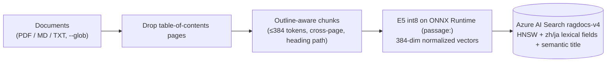
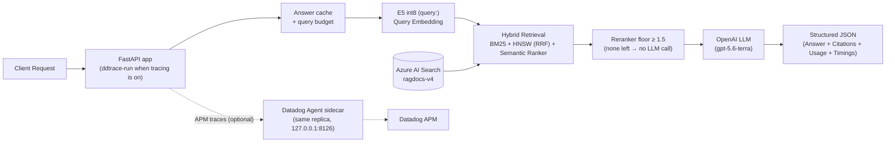
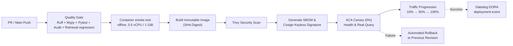
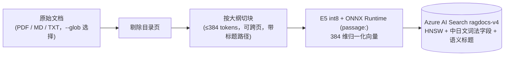
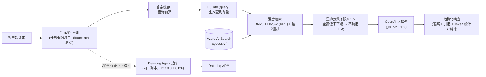
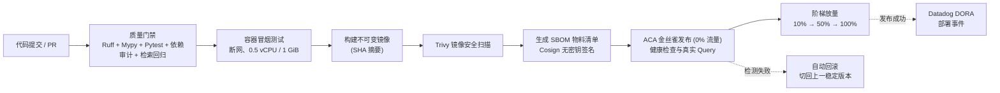
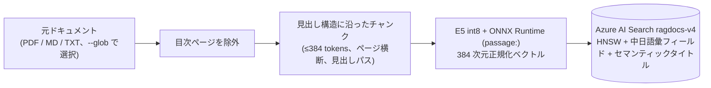
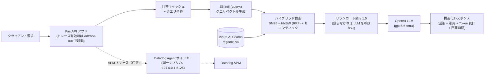
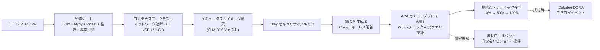

# Serverless Multilingual RAG on Azure

[](https://github.com/workHMZ/aca-ghcr-cicd-lab/actions/workflows/ci.yml)
[](https://github.com/workHMZ/aca-ghcr-cicd-lab/actions/workflows/security.yml)
[](https://www.python.org/)
[](#configuration-reference)

Cost-optimized serverless multilingual Retrieval-Augmented Generation (RAG) service on Azure Container Apps: local multilingual embeddings on ONNX Runtime, Azure AI Search hybrid retrieval with semantic reranking, and OpenAI Structured Outputs — sized to run inside Azure's free tiers.

[English](#english) | [中文](#中文) | [日本語](#日本語)

---

## Project Structure

```text
├── app/
│   ├── config.py                          # Validated Pydantic runtime settings
│   ├── model_manifest.py                  # Pinned model revision + SHA-256 of every file, verified downloader
│   ├── embed.py                           # E5 query/passage embeddings on ONNX Runtime (int8, 384-dim)
│   ├── chunking.py                        # Outline-aware, cross-page chunking with TOC detection
│   ├── guardrails.py                      # Answer cache and per-minute/per-day query budget
│   ├── search_client.py                   # Cached Azure AI Search client
│   ├── main.py                            # Async FastAPI: retrieval, reranker floor, structured generation
│   └── __main__.py                        # Container entrypoint (ddtrace-run only when tracing is on)
├── eval/
│   ├── golden_corpus.jsonl                # 50 labelled zh/ja/en questions about the real corpus (page-level)
│   ├── corpus.jsonl                       # Synthetic multilingual fixture (offline CI regression)
│   └── golden.jsonl                       # Labels for the synthetic fixture
├── scripts/
│   ├── create_index.py                    # Versioned index (HNSW + semantic + zh/ja lexical fields)
│   ├── ingest.py                          # PDF/MD/TXT → chunks → embeddings → index (idempotent, --glob)
│   ├── clear_index.py                     # Confirmed purge of every document in an index
│   ├── evaluate_retrieval.py              # Recall@K / MRR: local fixture or Azure ablation per mode
│   ├── smoke_container.sh                 # Offline boot under 0.5 vCPU / 1 GiB with memory budget
│   ├── deploy_canary.sh                   # Progressive ACA canary rollout & automated rollback
│   ├── test_api.py                        # API smoke testing
│   ├── verify.sh                          # Local quality gate (Ruff, Mypy, pip-audit, Pytest)
│   ├── setup-azure.sh                     # One-time bootstrap (capped logs, free-tier sizing)
│   ├── sync_datadog_catalog.sh            # Datadog Service Catalog sync
│   └── send_datadog_dora_deployment.sh    # Datadog DORA deployment tracking
├── .github/workflows/
│   ├── ci.yml                             # Quality gates → container smoke → image → SBOM → Cosign
│   ├── cd.yml                             # Signature verification → canary deployment → rollback
│   └── security.yml                       # CodeQL, filesystem/IaC/secret and image scanning
├── terraform/                             # Container Apps, Log Analytics and CI identity as code
├── data/                                  # Source documents (git-ignored)
├── service.datadog.yaml                   # Datadog Service Catalog metadata
└── pyproject.toml                         # Unified project configuration & dependencies
```

---

<a id="english"></a>

## English

### Overview & Core Value

Production RAG usually brings recurring embedding API costs, uneven retrieval across languages, and risky deployments. This project shows how to avoid all three on a budget of zero Azure spend:

- **Local multilingual embeddings on ONNX Runtime**: `multilingual-e5-small` (pinned revision, SHA-256-verified int8 ONNX export) with asymmetric `query:` / `passage:` prefixes. No embedding API, no PyTorch in the image, and a 0.5 vCPU / 1 GiB application container.
- **Structure-aware retrieval**: outline-aligned, cross-page chunks with heading context, table-of-contents pages removed, Chinese/Japanese word-level BM25 fused with HNSW vectors (RRF) and the Azure AI Search semantic ranker.
- **Grounded structured outputs**: OpenAI Responses API returns validated citations; low-relevance contexts are dropped before generation, and off-topic questions skip the LLM entirely.
- **Public-endpoint cost guardrails**: answer cache plus per-minute and per-day query budgets protect the OpenAI bill and the free semantic-ranker quota.
- **Supply chain security & canary releases**: exact-digest Trivy scans, CycloneDX SBOM, Cosign keyless signing verified by CD, and progressive traffic shifting (0% → 10% → 50% → 100%) with automated rollback.
- **Measured quality**: a 50-question labelled benchmark on the real corpus evaluates every retrieval mode on Azure; a synthetic fixture gates CI offline.

---

### 3.1 Results

Measured on 2026-09-23/24 against the deployed Azure AI Search service with `eval/golden_corpus.jsonl` (50 questions: 25 `zh`, 12 `ja`, 13 `en`; a hit is a chunk whose page range covers a labelled answer page).

**Served configuration (hybrid + semantic ranker)**

| Metric | 3.0 (`ragdocs-v3`) | 3.1 (`ragdocs-v4`) |
|---|---|---|
| Recall@1 | 0.84 | **0.96** |
| Recall@3 | 0.94 | **0.98** |
| MRR@10 | 0.900 | **0.967** |
| `en` / `ja` / `zh` Recall@1 | 0.69 / 0.83 / 0.92 | **1.00 / 0.92 / 0.96** |
| Table-of-contents pages in top-5 | 14% | **0%** |

**Ablation (Recall@1 / MRR@10)**

| Retrieval mode | 3.0 | 3.1 |
|---|---|---|
| BM25 only | 0.64 / 0.732 | 0.80 / 0.839 |
| Vector only | 0.76 / 0.820 | 0.84 / 0.891 |
| Hybrid (RRF) | 0.76 / 0.829 | 0.86 / 0.903 |
| Hybrid + semantic ranker | 0.84 / 0.900 | **0.96 / 0.967** |

Where the gain comes from:
- **Outline-aware chunking with heading context** lifted vector-only Recall@1 from 0.76 to 0.84–0.88 (depending on chunk-size settings). Chunks now end at the next question instead of a page break, and continuation chunks embed their question title.
- **TOC removal**: pages 2–17 of the source PDF list every question without answers; they took 14% of the served top-5 slots (20% for BM25).
- **Language-specific lexical fields**: on v4, BM25 with `standard.lucene` alone reaches Recall@1 0.72; adding `zh-Hans.microsoft` and `ja.microsoft` copies raises it to 0.80.
- **int8 vs fp32**: equal within one query on this benchmark; int8 vectors from an x86 CPU without AVX2 and from ARM agree at cosine ≥ 0.994.

**Serving footprint**

| | 3.0 | 3.1 |
|---|---|---|
| Embedding runtime | PyTorch + sentence-transformers, fp32 (470 MB weights) | ONNX Runtime, int8 (118 MB weights) |
| Replica size | 1 vCPU / 2 GiB + Datadog sidecar 0.5 vCPU / 1 GiB | **0.5 vCPU / 1 GiB** (+0.5 vCPU / 1 GiB with the optional Datadog sidecar) |
| Replica runtime covered by the free grant | ~33 h / month | **~100 h / month** (~50 h with the sidecar) |
| `/ready` endpoint | runs an embedding inference on every call | flag check after a one-time background load |
| Query embedding latency (1 thread) | — | 77 ms p50 on a Celeron J4125 (no AVX2), 3 ms on Apple silicon |

3.0 cold start was measured at ~60 s (14 s scheduling, 40 s pulling a 735 MB image, 11 s of Python imports). 3.1 removes PyTorch, transformers, scikit-learn and SciPy from the image and replaces the 470 MB fp32 weights with the 118 MB int8 export; CI reports the new image size on every run.

---

### Azure Free-Tier Fit

| Service | Free allowance | How this project stays inside it |
|---|---|---|
| Container Apps (Consumption) | 180,000 vCPU-s, 360,000 GiB-s, 2 M requests / month | `min_replicas = 0`, 0.5 vCPU / 1 GiB → ~100 replica-hours (half with the optional Datadog sidecar); each cold visit bills at least the 300 s cooldown, i.e. ~1,200 cold visits / month |
| Azure AI Search (Free) | 50 MB, 3 indexes, semantic ranker 1,000 requests / month | v4 index uses 3.2 MB (vectors are `stored=False`); cache + daily budget protect the semantic quota, and `semantic_error_mode=partial` degrades to hybrid ranking when it runs out |
| Log Analytics | 5 GB ingestion / month, 31-day retention | 30-day retention; Terraform and `setup-azure.sh` set a 0.16 GB/day ingestion cap; Azure SDK request logging is silenced in the app |
| GitHub Container Registry | free for public images | immutable digests, signed |

Cost Management shows **¥0** for the project resource group from June to September 2026. The only metered dependency is OpenAI, which is bounded by the answer cache, `QUERY_RATE_LIMIT_PER_MINUTE`, `QUERY_DAILY_LIMIT`, and the reranker floor (off-topic questions never reach the LLM). Datadog APM stays available as an experimental opt-in (`enable_datadog_sidecar = true`; CD turns tracing on automatically when the Agent sidecar is present) because the sidecar alone consumes a third of the free grant.

---

### End-to-End Pipelines

#### 1. Data Ingestion Pipeline

```mermaid
flowchart LR
    Docs["Documents<br/>(PDF / MD / TXT, --glob)"] --> TOC["Drop table-of-contents pages"]
    TOC --> Chunk["Outline-aware chunks<br/>(≤384 tokens, cross-page, heading path)"]
    Chunk --> Embed["E5 int8 on ONNX Runtime (passage:)<br/>384-dim normalized vectors"]
    Embed --> Index[("Azure AI Search ragdocs-v4<br/>HNSW + zh/ja lexical fields + semantic title")]
```

#### 2. Online Query Pipeline

```mermaid
flowchart LR
    Client["Client Request"] --> API["FastAPI app<br/>(ddtrace-run when tracing is on)"]
    API --> Guard["Answer cache<br/>+ query budget"]
    Guard --> QVec["E5 int8 (query:)<br/>Query Embedding"]
    QVec --> Hybrid["Hybrid Retrieval<br/>BM25 + HNSW (RRF) + Semantic Ranker"]
    Index[("Azure AI Search<br/>ragdocs-v4")] --> Hybrid
    Hybrid --> Floor["Reranker floor ≥ 1.5<br/>(none left → no LLM call)"]
    Floor --> LLM["OpenAI LLM<br/>(gpt-5.6-terra)"]
    LLM --> Response["Structured JSON<br/>(Answer + Citations + Usage + Timings)"]
    API -. "APM traces (optional)" .-> Agent["Datadog Agent sidecar<br/>(same replica, 127.0.0.1:8126)"]
    Agent -.-> APM["Datadog APM"]
```

Datadog uses the **sidecar pattern**: the Agent runs as a second container in the same Container Apps replica and receives traces over `127.0.0.1:8126`. It is experimental and optional — CD turns tracing on only when the sidecar is deployed.

#### 3. Secure CI/CD Canary Pipeline

```mermaid
flowchart LR
    PR["PR / Main Push"] --> Lint["Quality Gate<br/>Ruff + Mypy + Pytest + Audit + Retrieval regression"]
    Lint --> Smoke["Container smoke test<br/>offline, 0.5 vCPU / 1 GiB"]
    Smoke --> Build["Build Immutable Image<br/>(SHA Digest)"]
    Build --> Scan["Trivy Security Scan"]
    Scan --> SBOM["Generate SBOM &<br/>Cosign Keyless Signature"]
    SBOM --> Canary["ACA Canary (0%)<br/>Health & Real Query"]
    Canary --> Promote["Traffic Progression<br/>10% → 50% → 100%"]
    Canary -. "Failure" .-> Rollback["Automated Rollback<br/>to Previous Revision"]
    Promote -. "Success" .-> DORA["Datadog DORA<br/>deployment event"]
```

---

### Key Features

1. **Multilingual hybrid retrieval**
   - Fixed model revision `intfloat/multilingual-e5-small@614241f...`; the ONNX file and tokenizer are SHA-256-pinned in `app/model_manifest.py`.
   - Outline-aware chunking: numbered/Markdown/chapter headings drive cut points, sub-points stay with their question, chunks may span pages, and chunk text is sliced from the source (never re-decoded).
   - Index `ragdocs-v4`: cosine HNSW, semantic configuration with a `title` field, word-segmented Chinese/Japanese lexical copies, page ranges, and `embeddingVariant` on every chunk.
2. **Grounded synthesis & safety**
   - Retrieved chunks are wrapped as untrusted evidence; Pydantic validates answers, citations, and groundedness.
   - Contexts under the semantic reranker floor are dropped; if none remain, the service answers "insufficient evidence" without calling the LLM.
3. **Cost guardrails & observability**
   - TTL answer cache (`Cache-Control: no-cache` bypasses it), per-minute token bucket, and per-UTC-day ceiling with `429 Retry-After`.
   - Per-request `embedding_ms` / `search_ms` / `generation_ms` timings in the response and structured JSON logs; optional Datadog APM and DORA deployment events.
4. **Evaluation**
   - `eval/golden_corpus.jsonl` measures the real index per retrieval mode and prints a reranker-floor calibration; the synthetic fixture remains the fast offline CI gate.

---

### Runbook

#### 1. Local Setup
```bash
# Install dependencies with locked environment
uv sync --frozen --dev

# Configure environment variables
cp .env.example .env
# Edit .env and supply AZURE_SEARCH_ENDPOINT, AZURE_SEARCH_API_KEY, OPENAI_API_KEY
```
The embedding model is downloaded on first use into `~/.cache/serverless-rag` and verified against the pinned SHA-256 values (container images bake it in and run offline).

#### 2. Index Management & Data Ingestion
```bash
# Create the versioned Azure AI Search index
uv run python scripts/create_index.py --index-name ragdocs-v4

# Preview chunking without embedding or uploading
uv run python scripts/ingest.py --data-dir data --glob '*.pdf' --dry-run

# Ingest only the public documents you select
uv run python scripts/ingest.py --data-dir data --glob '*.pdf' --index-name ragdocs-v4
```
Everything ingested is returned verbatim by a public API: select files with `--glob` and never point ingestion at private notes. Re-ingestion is idempotent and prunes stale chunks per source.

#### 3. Run Locally & Probe API
```bash
# Start FastAPI application
uv run uvicorn app.main:app --host 127.0.0.1 --port 8000

# Probe health & readiness
curl -fsS http://127.0.0.1:8000/health
curl -fsS http://127.0.0.1:8000/ready

# Test query endpoint
curl -fsS http://127.0.0.1:8000/query \
  -H 'Content-Type: application/json' \
  --data '{"question": "How does HashMap handle collisions in Java 8?", "top_k": 3}'
```

#### 4. Retrieval Evaluation
```bash
# Real corpus on Azure: ablation across retrieval modes (uses 50 semantic-ranker requests per semantic run)
uv run python scripts/evaluate_retrieval.py --backend azure --index-name ragdocs-v4 \
  --mode semantic --mode hybrid --mode vector --mode bm25

# Offline model comparison on the synthetic fixture (the CI regression gate)
uv run python scripts/evaluate_retrieval.py \
  --backend local \
  --model sentence-transformers/all-MiniLM-L6-v2 --revision 1110a243fdf4706b3f48f1d95db1a4f5529b4d41 \
  --model intfloat/multilingual-e5-small --revision 614241f622f53c4eeff9890bdc4f31cfecc418b3
```
The Azure run also prints `reranker_calibration`: how many labelled and unlabelled top-k contexts each candidate floor would keep. The served floor of 1.5 keeps every labelled hit (lowest 1.90) while off-topic questions peak between 0.5 and 1.6.

`--backend local` reads only `eval/corpus.jsonl` and `eval/golden.jsonl`; the pinned E5 model runs through the production ONNX encoder, other models through sentence-transformers. Result on the bundled fixture (9 passages, 6 queries, 2 each in `en` / `ja` / `zh`):

| Model | Recall@1 | Recall@3 | MRR | `ja` Recall@1 |
|---|---|---|---|---|
| `all-MiniLM-L6-v2` (baseline, torch) | 0.833 | 1.000 | 0.917 | 0.500 |
| `multilingual-e5-small` (served, ONNX int8) | **1.000** | 1.000 | **1.000** | **1.000** |
| Delta | +0.167 | 0.000 | +0.083 | +0.500 |

The fixture is synthetic and deliberately small — a regression gate, not production quality; the evaluator repeats this in its `warning` field.

#### 5. Local Quality Gate
```bash
# Run full verification (formatting, linting, type checks, dependency audit, coverage)
# `uv run` puts .venv/bin on PATH, exactly as the CI job does.
uv run bash scripts/verify.sh
```
This is the same script CI executes: `ruff format --check`, `ruff check`, `mypy`, `pip-audit` against the exported runtime lock, and `pytest` with an 80% coverage floor. CI additionally boots the built image with `--network none --cpus 0.5 --memory 1g` (`scripts/smoke_container.sh`) and fails if the model cannot load offline or memory exceeds 900 MiB.

#### 6. Rollback Procedure
If canary checks fail, the pipeline restores 100% traffic to the stable revision automatically. After a successful rollout every other revision is deactivated (inactive revisions cost nothing and stay available). To restore traffic manually:
```bash
az containerapp revision activate --name <app-name> --resource-group <resource-group> --revision <stable-revision-name>
az containerapp ingress traffic set \
  --name <app-name> \
  --resource-group <resource-group> \
  --revision-weight <stable-revision-name>=100
```

---

### Configuration Reference

| Environment Variable | Default Value | Description |
|---|---|---|
| `AZURE_SEARCH_ENDPOINT` | - | Azure AI Search service endpoint URL |
| `AZURE_SEARCH_API_KEY` | - | Azure AI Search admin/query key |
| `AZURE_SEARCH_INDEX_NAME` | `ragdocs-v4` | Index the running application queries |
| `AZURE_SEARCH_INDEX_NAME_V4` | `ragdocs-v4` | Index targeted by `scripts/` (create, ingest, clear, evaluate) |
| `SEARCH_MIN_RERANKER_SCORE` | `1.5` | Semantic ranker floor (0–4) below which contexts are dropped |
| `OPENAI_API_KEY` | - | OpenAI API authentication key |
| `OPENAI_MODEL` | `gpt-5.6-terra` | Generation model ID |
| `OPENAI_REASONING_EFFORT` | `low` | Reasoning effort budget for generation |
| `EMBEDDING_MODEL` / `EMBEDDING_MODEL_REVISION` | `intfloat/multilingual-e5-small` / `614241f...` | Validated literals; any other value fails startup |
| `EMBEDDING_VARIANT` | `onnx-qint8` | ONNX file served (`onnx-fp32` needs ~0.9 GB more memory); must match the index |
| `EMBEDDING_MODEL_PATH` | - | Pre-downloaded model directory (the image sets it); unset uses `~/.cache/serverless-rag` |
| `EMBEDDING_OFFLINE` | `false` | Forbid model downloads at runtime (`HF_HUB_OFFLINE` is also accepted) |
| `EMBEDDING_THREADS` | `1` | ONNX Runtime intra-op threads; keep ≤ the replica's vCPU quota |
| `EMBEDDING_BATCH_SIZE` | `16` | Batch size for passage encoding |
| `ANSWER_CACHE_TTL_SECONDS` | `3600` | Answer cache lifetime (0 disables) |
| `QUERY_RATE_LIMIT_PER_MINUTE` / `QUERY_DAILY_LIMIT` | `20` / `500` | Uncached query budget per replica (0 disables) |
| `DD_TRACE_ENABLED` | `false` | Wrap uvicorn with `ddtrace-run`; CD sets it from the presence of the Datadog Agent sidecar (repository variable overrides) |
| `SEARCH_TOP_K_DEFAULT` / `SEARCH_TOP_K_MAX` | `5` / `10` | Default and maximum `top_k` |

---

### Design Decisions & Trade-offs

- **ONNX int8 vs. PyTorch fp32**: the pinned revision already publishes an int8 ONNX export. Serving it removes PyTorch from the image, and the int8 session adds ~0.3 GB of resident memory versus ~1.2 GB for fp32 (the whole embedding runtime is ~0.45 GB on Linux), which is what makes 0.5 vCPU / 1 GiB replicas possible. On the benchmark the two are equal within one query; the trade-off is that the index must be embedded by the same variant, which `embeddingVariant` enforces.
- **Outline-aware chunking vs. page chunking**: interview-style documents are lists of questions. Cutting at top-level headings keeps each answer whole, heading paths give continuation chunks context, and the TOC detector (headings that reappear later) removes pages that match everything but answer nothing. Heading-level recovery from plain PDF text is heuristic; when it fails the chunker falls back to line and sentence boundaries.
- **Lexical copies per language vs. one analyzer**: `standard.lucene` splits Chinese into single characters. Hidden `contentZh` / `contentJa` copies add word-level BM25 at little storage cost (the whole v4 index is 3.2 MB); the semantic ranker still reads the language-neutral `content`.
- **Reranker floor vs. always generating**: dropping contexts below 1.5 avoids feeding the LLM noise and skips generation for off-topic questions. The threshold is calibrated from the benchmark and printed by every Azure evaluation run.
- **In-process guardrails vs. API Management**: an answer cache and token bucket inside the app cost nothing and are exact with `max_replicas = 1`; a multi-replica or multi-region deployment would move them to Azure API Management or a shared store.
- **Serverless scale-to-zero vs. cold start**: idle costs nothing; a visit after idleness pays scheduling, image pull, and model load. 3.1 shrinks the image and preloads the model in the background so `/ready` flips as soon as queries can be served. A latency-sensitive deployment would set `min_replicas = 1`, which leaves the free grant.
- **Index isolation (`ragdocs-v4`)**: every chunk carries `embeddingModel`, `embeddingRevision`, and `embeddingVariant`; the service rejects mismatched results, so a stale index fails loudly instead of returning wrong neighbours.
- **Bash canary vs. Operator**: progressive delivery is a reviewable shell script (`scripts/deploy_canary.sh`), keeping revision state and rollback logic transparent in workflow logs.

---

<a id="中文"></a>

## 中文

### 项目概述与核心价值

在生产环境落地 RAG 时，通常要面对持续的 Embedding API 费用、跨语言检索不稳定、以及发布风险。本项目演示如何在 **Azure 零花费** 的前提下同时解决这三点：

- **基于 ONNX Runtime 的本地多语言向量化**：`multilingual-e5-small`（锁定版本，SHA-256 校验的 int8 ONNX 导出）+ `query:` / `passage:` 非对称前缀。无 Embedding API 费用、镜像中不含 PyTorch，应用容器仅需 0.5 vCPU / 1 GiB。
- **结构感知检索**：按题目大纲跨页切块并附带标题上下文，剔除目录页；中文/日文分词级 BM25 与 HNSW 向量经 RRF 融合，再由 Azure AI Search 语义重排序。
- **结构化可信生成**：OpenAI Responses API 输出带校验引用的 JSON；低相关上下文在生成前被丢弃，离题问题直接跳过大模型调用。
- **公开接口成本护栏**：答案缓存 + 每分钟/每日查询预算，保护 OpenAI 账单与免费语义重排额度。
- **供应链安全与金丝雀发布**：按镜像摘要执行 Trivy 扫描、CycloneDX SBOM、Cosign 无密钥签名（CD 校验签名），0% → 10% → 50% → 100% 灰度放量与自动回滚。
- **可量化的质量**：基于真实语料的 50 题标注评测集在 Azure 上逐检索模式评估；合成评测集作为 CI 离线门禁。

---

### 3.1 实测结果

2026-09-23/24 在线上 Azure AI Search 服务上使用 `eval/golden_corpus.jsonl` 测得（50 题：中文 25、日文 12、英文 13；命中定义为结果块的页码区间覆盖标注答案页）。

**线上配置（混合检索 + 语义重排）**

| 指标 | 3.0（`ragdocs-v3`） | 3.1（`ragdocs-v4`） |
|---|---|---|
| Recall@1 | 0.84 | **0.96** |
| Recall@3 | 0.94 | **0.98** |
| MRR@10 | 0.900 | **0.967** |
| `en` / `ja` / `zh` Recall@1 | 0.69 / 0.83 / 0.92 | **1.00 / 0.92 / 0.96** |
| top-5 中目录页占比 | 14% | **0%** |

**消融实验（Recall@1 / MRR@10）**

| 检索模式 | 3.0 | 3.1 |
|---|---|---|
| 仅 BM25 | 0.64 / 0.732 | 0.80 / 0.839 |
| 仅向量 | 0.76 / 0.820 | 0.84 / 0.891 |
| 混合（RRF） | 0.76 / 0.829 | 0.86 / 0.903 |
| 混合 + 语义重排 | 0.84 / 0.900 | **0.96 / 0.967** |

提升来源：
- **按大纲切块 + 标题上下文**：纯向量 Recall@1 从 0.76 提升到 0.84–0.88（随切块参数变化）。切块在下一道题处结束而不是在分页处，续块也会嵌入所属题目标题。
- **剔除目录页**：源 PDF 第 2–17 页列出了全部题目但没有答案，曾占据线上 top-5 的 14%（BM25 下为 20%）。
- **按语言分词的词法字段**：在 v4 上，仅用 `standard.lucene` 的 BM25 Recall@1 为 0.72，加上 `zh-Hans.microsoft` 与 `ja.microsoft` 副本字段后为 0.80。
- **int8 与 fp32**：在该评测集上相差不超过 1 题；无 AVX2 的 x86 CPU 与 ARM 上生成的 int8 向量余弦相似度 ≥ 0.994。

**服务资源占用**

| | 3.0 | 3.1 |
|---|---|---|
| 向量化运行时 | PyTorch + sentence-transformers，fp32（权重 470 MB） | ONNX Runtime，int8（权重 118 MB） |
| 副本规格 | 1 vCPU / 2 GiB + Datadog 边车 0.5 vCPU / 1 GiB | **0.5 vCPU / 1 GiB**（启用可选 Datadog 边车时另加 0.5 vCPU / 1 GiB） |
| 免费额度可覆盖的副本运行时长 | 约 33 小时/月 | **约 100 小时/月**（带边车约 50 小时） |
| `/ready` 接口 | 每次调用都执行一次向量推理 | 后台一次性加载后仅检查标志位 |
| 查询向量化延迟（单线程） | — | Celeron J4125（无 AVX2）p50 77 ms，Apple Silicon 3 ms |

3.0 的冷启动实测约 60 秒（调度 14 秒、拉取 735 MB 镜像 40 秒、Python 导入 11 秒）。3.1 从镜像中移除了 PyTorch、transformers、scikit-learn 与 SciPy，并以 118 MB 的 int8 权重替换 470 MB 的 fp32 权重；CI 每次运行都会报告新镜像大小。

---

### Azure 免费额度适配

| 服务 | 免费额度 | 本项目如何控制在额度内 |
|---|---|---|
| Container Apps（Consumption） | 每月 180,000 vCPU 秒、360,000 GiB 秒、200 万次请求 | `min_replicas = 0`，0.5 vCPU / 1 GiB → 约 100 副本小时（启用可选 Datadog 边车时减半）；每次冷启动访问至少计费 300 秒冷却期，约可支撑每月 1,200 次冷访问 |
| Azure AI Search（Free） | 50 MB、3 个索引、语义重排每月 1,000 次 | v4 索引仅占 3.2 MB（向量 `stored=False`）；缓存 + 每日预算保护语义额度，额度耗尽时 `semantic_error_mode=partial` 自动降级为混合排序 |
| Log Analytics | 每月 5 GB 摄取、31 天保留 | 保留 30 天；Terraform 与 `setup-azure.sh` 设置每日 0.16 GB 摄取上限；应用内关闭 Azure SDK 请求日志 |
| GitHub Container Registry | 公开镜像免费 | 不可变摘要 + 签名 |

Cost Management 显示本项目资源组 2026 年 6–9 月花费为 **¥0**。唯一计费的外部依赖是 OpenAI，由答案缓存、`QUERY_RATE_LIMIT_PER_MINUTE`、`QUERY_DAILY_LIMIT` 与重排分数下限共同约束（离题问题不会到达大模型）。Datadog APM 保留为试验性可选项（`enable_datadog_sidecar = true`；检测到 Agent 边车时 CD 会自动开启追踪），因为仅边车就会消耗三分之一的免费额度。

---

### 端到端核心链路

#### 1. 数据摄取链路 (Data Ingestion Pipeline)

```mermaid
flowchart LR
    Docs["原始文档<br/>(PDF / MD / TXT，--glob 选择)"] --> TOC["剔除目录页"]
    TOC --> Chunk["按大纲切块<br/>(≤384 tokens，可跨页，带标题路径)"]
    Chunk --> Embed["E5 int8 + ONNX Runtime (passage:)<br/>384 维归一化向量"]
    Embed --> Index[("Azure AI Search ragdocs-v4<br/>HNSW + 中日文词法字段 + 语义标题")]
```

#### 2. 在线检索与生成链路 (Online Query Pipeline)

```mermaid
flowchart LR
    Client["客户端请求"] --> API["FastAPI 应用<br/>(开启追踪时由 ddtrace-run 启动)"]
    API --> Guard["答案缓存<br/>+ 查询预算"]
    Guard --> QVec["E5 int8 (query:)<br/>生成查询向量"]
    QVec --> Hybrid["混合检索<br/>BM25 + HNSW (RRF) + 语义重排"]
    Index[("Azure AI Search<br/>ragdocs-v4")] --> Hybrid
    Hybrid --> Floor["重排分数下限 ≥ 1.5<br/>(全部低于下限 → 不调用 LLM)"]
    Floor --> LLM["OpenAI 大模型<br/>(gpt-5.6-terra)"]
    LLM --> Response["结构化响应<br/>(答案 + 引用 + Token 统计 + 耗时)"]
    API -. "APM 追踪（可选）" .-> Agent["Datadog Agent 边车<br/>(同一副本，127.0.0.1:8126)"]
    Agent -.-> APM["Datadog APM"]
```

Datadog 采用 **Sidecar（边车）模式**：Agent 作为同一 Container Apps 副本中的第二个容器运行，应用通过 `127.0.0.1:8126` 把 trace 发给它。该功能为试验性可选项，只有部署了边车时 CD 才会开启追踪。

#### 3. 安全 CI/CD 金丝雀发布链路 (Canary Delivery Pipeline)

```mermaid
flowchart LR
    PR["代码提交 / PR"] --> Lint["质量门禁<br/>Ruff + Mypy + Pytest + 依赖审计 + 检索回归"]
    Lint --> Smoke["容器冒烟测试<br/>断网、0.5 vCPU / 1 GiB"]
    Smoke --> Build["构建不可变镜像<br/>(SHA 摘要)"]
    Build --> Scan["Trivy 镜像安全扫描"]
    Scan --> SBOM["生成 SBOM 物料清单<br/>Cosign 无密钥签名"]
    SBOM --> Canary["ACA 金丝雀发布 (0% 流量)<br/>健康检查与真实 Query"]
    Canary --> Promote["阶梯放量<br/>10% → 50% → 100%"]
    Canary -. "检测失败" .-> Rollback["自动回滚<br/>切回上一稳定版本"]
    Promote -. "发布成功" .-> DORA["Datadog DORA<br/>部署事件"]
```

---

### 核心技术特性

1. **多语言混合检索**
   - 锁定模型版本 `intfloat/multilingual-e5-small@614241f...`，ONNX 文件与分词器的 SHA-256 固定在 `app/model_manifest.py`。
   - 结构感知切块：编号/Markdown/章节标题决定切分点，子要点留在所属题目内，块可跨页，块文本直接从原文切片（不经分词器解码还原）。
   - `ragdocs-v4` 索引：余弦 HNSW、带 `title` 字段的语义配置、中日文分词词法副本、页码区间，每个块记录 `embeddingVariant`。
2. **结构化生成与防注入**
   - 检索内容作为不可信证据隔离；Pydantic 校验答案、引用与可信度。
   - 低于语义重排下限的上下文被丢弃；若全部被丢弃则直接返回"资料不足"，不调用大模型。
3. **成本护栏与可观测性**
   - TTL 答案缓存（`Cache-Control: no-cache` 可绕过）、每分钟令牌桶与每日（UTC）上限，超限返回 `429 Retry-After`。
   - 响应与结构化 JSON 日志中包含 `embedding_ms` / `search_ms` / `generation_ms` 分段耗时；Datadog APM 与 DORA 部署事件可选开启。
4. **评测体系**
   - `eval/golden_corpus.jsonl` 按检索模式评估真实索引，并输出重排下限校准数据；合成评测集继续作为快速的 CI 离线门禁。

---

### 运维手册 (Runbook)

#### 1. 本地环境初始化
```bash
# 使用 uv 安装锁定依赖
uv sync --frozen --dev

# 配置环境变量
cp .env.example .env
# 编辑 .env 文件，填入 AZURE_SEARCH_ENDPOINT、AZURE_SEARCH_API_KEY 与 OPENAI_API_KEY
```
向量模型首次使用时下载到 `~/.cache/serverless-rag` 并按固定的 SHA-256 校验（容器镜像在构建时内置模型并离线运行）。

#### 2. 索引创建与文档摄取
```bash
# 创建版本化的 Azure AI Search 索引
uv run python scripts/create_index.py --index-name ragdocs-v4

# 仅预览切块结果，不向量化也不上传
uv run python scripts/ingest.py --data-dir data --glob '*.pdf' --dry-run

# 只摄取你选定的公开文档
uv run python scripts/ingest.py --data-dir data --glob '*.pdf' --index-name ragdocs-v4
```
摄取的所有内容都会被公开 API 原样返回：请用 `--glob` 精确选择文件，切勿把私人笔记放进索引。重复摄取是幂等的，并会按来源清理过期块。

#### 3. 本地启动与接口验证
```bash
# 启动 FastAPI 服务
uv run uvicorn app.main:app --host 127.0.0.1 --port 8000

# 探测健康与就绪探针
curl -fsS http://127.0.0.1:8000/health
curl -fsS http://127.0.0.1:8000/ready

# 验证 RAG 查询接口
curl -fsS http://127.0.0.1:8000/query \
  -H 'Content-Type: application/json' \
  --data '{"question": "Java 中 HashMap 的工作原理是什么？", "top_k": 3}'
```

#### 4. 检索质量评测
```bash
# 在 Azure 上评测真实语料：各检索模式消融（每次语义模式运行消耗 50 次语义重排额度）
uv run python scripts/evaluate_retrieval.py --backend azure --index-name ragdocs-v4 \
  --mode semantic --mode hybrid --mode vector --mode bm25

# 在合成评测集上离线对比模型（CI 回归门禁）
uv run python scripts/evaluate_retrieval.py \
  --backend local \
  --model sentence-transformers/all-MiniLM-L6-v2 --revision 1110a243fdf4706b3f48f1d95db1a4f5529b4d41 \
  --model intfloat/multilingual-e5-small --revision 614241f622f53c4eeff9890bdc4f31cfecc418b3
```
Azure 评测还会输出 `reranker_calibration`：每个候选下限在 top-k 中会保留多少标注命中与非标注结果。线上下限 1.5 保留了全部标注命中（最低 1.90），而离题问题的最高分在 0.5–1.6 之间。

`--backend local` 仅读取 `eval/corpus.jsonl` 与 `eval/golden.jsonl`；锁定的 E5 模型走线上同款 ONNX 编码器，其他模型走 sentence-transformers。内置评测集（9 条 passage、6 条 query，`en` / `ja` / `zh` 各 2 条）结果：

| 模型 | Recall@1 | Recall@3 | MRR | `ja` Recall@1 |
|---|---|---|---|---|
| `all-MiniLM-L6-v2`（基线，torch） | 0.833 | 1.000 | 0.917 | 0.500 |
| `multilingual-e5-small`（线上，ONNX int8） | **1.000** | 1.000 | **1.000** | **1.000** |
| 差值 | +0.167 | 0.000 | +0.083 | +0.500 |

该评测集为合成数据且规模很小，只作为回归门禁，不代表生产质量；评测脚本也会在 `warning` 字段中声明。

#### 5. 本地质量门禁检查
```bash
# 执行完整质检（代码格式、类型检查、依赖漏洞扫描、单元测试与覆盖率）
# uv run 会把 .venv/bin 加入 PATH，与 CI 中的执行方式一致。
uv run bash scripts/verify.sh
```
该脚本与 CI 完全相同：`ruff format --check`、`ruff check`、`mypy`、针对导出运行时锁文件的 `pip-audit`，以及 80% 覆盖率下限的 `pytest`。CI 还会以 `--network none --cpus 0.5 --memory 1g` 启动构建出的镜像（`scripts/smoke_container.sh`），若模型无法离线加载或内存超过 900 MiB 则失败。

#### 6. 异常回滚流程
金丝雀检查失败时，流水线会自动把 100% 流量切回稳定版本。放量成功后其余版本全部停用（停用的版本不计费且可随时恢复）。手动回滚：
```bash
az containerapp revision activate --name <app-name> --resource-group <resource-group> --revision <stable-revision-name>
az containerapp ingress traffic set \
  --name <app-name> \
  --resource-group <resource-group> \
  --revision-weight <stable-revision-name>=100
```

---

### 环境变量配置说明

| 变量名 | 默认值 | 说明 |
|---|---|---|
| `AZURE_SEARCH_ENDPOINT` | - | Azure AI Search 服务终端地址 |
| `AZURE_SEARCH_API_KEY` | - | Azure AI Search 管理/查询密钥 |
| `AZURE_SEARCH_INDEX_NAME` | `ragdocs-v4` | 在线服务查询的索引 |
| `AZURE_SEARCH_INDEX_NAME_V4` | `ragdocs-v4` | `scripts/`（建索引、摄取、清理、评测）操作的索引 |
| `SEARCH_MIN_RERANKER_SCORE` | `1.5` | 语义重排分数下限（0–4），低于该值的上下文被丢弃 |
| `OPENAI_API_KEY` | - | OpenAI API 鉴权密钥 |
| `OPENAI_MODEL` | `gpt-5.6-terra` | 答案生成模型 |
| `OPENAI_REASONING_EFFORT` | `low` | 生成模型推理预算 |
| `EMBEDDING_MODEL` / `EMBEDDING_MODEL_REVISION` | `intfloat/multilingual-e5-small` / `614241f...` | 字面量校验，填其他值启动失败 |
| `EMBEDDING_VARIANT` | `onnx-qint8` | 使用的 ONNX 文件（`onnx-fp32` 需多约 0.9 GB 内存），必须与索引一致 |
| `EMBEDDING_MODEL_PATH` | - | 预下载的模型目录（镜像内已设置）；留空使用 `~/.cache/serverless-rag` |
| `EMBEDDING_OFFLINE` | `false` | 运行时禁止下载模型（也接受 `HF_HUB_OFFLINE`） |
| `EMBEDDING_THREADS` | `1` | ONNX Runtime 算子内线程数，不应超过副本 vCPU 配额 |
| `EMBEDDING_BATCH_SIZE` | `16` | 段落向量化批大小 |
| `ANSWER_CACHE_TTL_SECONDS` | `3600` | 答案缓存有效期（0 为关闭） |
| `QUERY_RATE_LIMIT_PER_MINUTE` / `QUERY_DAILY_LIMIT` | `20` / `500` | 每副本未命中缓存的查询预算（0 为关闭） |
| `DD_TRACE_ENABLED` | `false` | 用 `ddtrace-run` 启动 uvicorn；CD 根据是否存在 Datadog Agent 边车自动设置（仓库变量可覆盖） |
| `SEARCH_TOP_K_DEFAULT` / `SEARCH_TOP_K_MAX` | `5` / `10` | 默认与最大 `top_k` |

---

### 架构设计与权衡

- **ONNX int8 vs. PyTorch fp32**：锁定版本本身就发布了 int8 ONNX 导出。改用它后镜像中不再有 PyTorch，int8 会话仅增加约 0.3 GB 常驻内存，而 fp32 需约 1.2 GB（Linux 上整个向量化运行时约 0.45 GB），这正是能使用 0.5 vCPU / 1 GiB 副本的前提。在评测集上二者相差不超过 1 题；代价是索引必须由同一变体生成，`embeddingVariant` 字段负责强制校验。
- **按大纲切块 vs. 按页切块**：面试题类文档本质是题目列表。在顶层标题处切分能保持答案完整，标题路径为续块提供上下文，目录页检测（后文会重复出现的标题）剔除了"匹配一切却不含答案"的页面。从纯 PDF 文本恢复标题层级是启发式的，失败时退化为按行、按句切分。
- **按语言的词法副本 vs. 单一分析器**：`standard.lucene` 会把中文切成单字。隐藏的 `contentZh` / `contentJa` 副本以很小的存储代价换来词级 BM25（整个 v4 索引仅 3.2 MB）；语义重排仍读取语言中立的 `content`。
- **重排下限 vs. 总是生成**：丢弃 1.5 以下的上下文可避免把噪声喂给大模型，并让离题问题跳过生成。阈值由评测集校准，每次 Azure 评测都会输出校准数据。
- **进程内护栏 vs. API Management**：应用内的答案缓存与令牌桶零成本，在 `max_replicas = 1` 时是精确的；多副本或多区域部署应迁移到 Azure API Management 或共享存储。
- **Serverless 缩容到零 vs. 冷启动**：空闲零费用；空闲后的首次访问要承担调度、拉镜像与加载模型的时间。3.1 缩小了镜像并在后台预加载模型，使 `/ready` 在可服务时立即转为就绪。对延迟敏感的部署可设 `min_replicas = 1`，但会超出免费额度。
- **索引隔离（`ragdocs-v4`）**：每个块都携带 `embeddingModel`、`embeddingRevision` 与 `embeddingVariant`，服务拒绝不匹配的结果——索引过期时直接报错，而不是悄悄返回错误的近邻。
- **Bash 金丝雀 vs. Operator**：渐进式发布采用可评审的 Shell 脚本（`scripts/deploy_canary.sh`），版本状态与回滚逻辑在流水线日志中透明可查。

---

<a id="日本語"></a>

## 日本語

### プロジェクト概要と提供価値

本番環境で RAG を運用する際は、Embedding API の継続コスト、多言語検索精度のばらつき、デプロイのリスクが課題になります。本プロジェクトは **Azure の利用料ゼロ** のまま、この 3 点を同時に解決する方法を示します：

- **ONNX Runtime によるローカル多言語 Embedding**：`multilingual-e5-small`（リビジョン固定・SHA-256 検証済みの int8 ONNX エクスポート）と `query:` / `passage:` 非対称プレフィックス。Embedding API 不要、イメージに PyTorch を含まず、アプリコンテナは 0.5 vCPU / 1 GiB で稼働。
- **構造を意識した検索**：設問の見出し構造に沿ってページをまたいでチャンク化し、見出しコンテキストを付与、目次ページを除外。中国語・日本語の単語単位 BM25 と HNSW ベクトルを RRF で統合し、Azure AI Search のセマンティックランカーで再順位付け。
- **根拠に基づく構造化出力**：OpenAI Responses API が検証済み引用付き JSON を返却。関連度の低いコンテキストは生成前に除外し、無関係な質問では LLM を呼び出しません。
- **公開エンドポイントのコストガードレール**：回答キャッシュと分単位・日単位のクエリ予算で OpenAI の請求と無料のセマンティックランカー枠を保護。
- **サプライチェーンセキュリティとカナリアリリース**：ダイジェスト単位の Trivy スキャン、CycloneDX SBOM、CD が検証する Cosign キーレス署名、0% → 10% → 50% → 100% の段階的移行と自動ロールバック。
- **定量的な品質評価**：実コーパスに対する 50 問のラベル付き評価セットで検索モードごとに Azure 上で測定し、合成フィクスチャで CI をオフライン検証。

---

### 3.1 の実測結果

2026-09-23/24、稼働中の Azure AI Search サービスに対して `eval/golden_corpus.jsonl` で測定（50 問：中国語 25・日本語 12・英語 13。チャンクのページ範囲が正解ページを含めばヒット）。

**本番構成（ハイブリッド + セマンティックランカー）**

| 指標 | 3.0（`ragdocs-v3`） | 3.1（`ragdocs-v4`） |
|---|---|---|
| Recall@1 | 0.84 | **0.96** |
| Recall@3 | 0.94 | **0.98** |
| MRR@10 | 0.900 | **0.967** |
| `en` / `ja` / `zh` Recall@1 | 0.69 / 0.83 / 0.92 | **1.00 / 0.92 / 0.96** |
| top-5 に占める目次ページ | 14% | **0%** |

**アブレーション（Recall@1 / MRR@10）**

| 検索モード | 3.0 | 3.1 |
|---|---|---|
| BM25 のみ | 0.64 / 0.732 | 0.80 / 0.839 |
| ベクトルのみ | 0.76 / 0.820 | 0.84 / 0.891 |
| ハイブリッド（RRF） | 0.76 / 0.829 | 0.86 / 0.903 |
| ハイブリッド + セマンティック | 0.84 / 0.900 | **0.96 / 0.967** |

改善の内訳：
- **見出し構造に沿ったチャンク化と見出しコンテキスト**：ベクトルのみの Recall@1 が 0.76 から 0.84–0.88 に向上（チャンクサイズ設定により変動）。チャンクはページ区切りではなく次の設問で終わり、続きのチャンクにも設問タイトルを埋め込みます。
- **目次ページの除外**：元 PDF の 2–17 ページは全設問を列挙するだけで回答を含まず、本番 top-5 の 14%（BM25 では 20%）を占めていました。
- **言語別の語彙フィールド**：v4 で `standard.lucene` のみの BM25 は Recall@1 0.72、`zh-Hans.microsoft` と `ja.microsoft` のコピーを加えると 0.80。
- **int8 と fp32**：本評価セットでの差は 1 問以内。AVX2 非対応の x86 CPU と ARM で生成した int8 ベクトルのコサイン類似度は 0.994 以上。

**サービングのリソース**

| | 3.0 | 3.1 |
|---|---|---|
| Embedding ランタイム | PyTorch + sentence-transformers、fp32（重み 470 MB） | ONNX Runtime、int8（重み 118 MB） |
| レプリカ構成 | 1 vCPU / 2 GiB + Datadog サイドカー 0.5 vCPU / 1 GiB | **0.5 vCPU / 1 GiB**（任意の Datadog サイドカー使用時は +0.5 vCPU / 1 GiB） |
| 無料枠でカバーできるレプリカ稼働時間 | 約 33 時間/月 | **約 100 時間/月**（サイドカー込みで約 50 時間） |
| `/ready` エンドポイント | 呼び出しごとに Embedding 推論を実行 | バックグラウンドでの初回ロード後はフラグ確認のみ |
| クエリ Embedding レイテンシ（1 スレッド） | — | Celeron J4125（AVX2 なし）で p50 77 ms、Apple silicon で 3 ms |

3.0 のコールドスタートは約 60 秒（スケジューリング 14 秒、735 MB イメージの取得 40 秒、Python インポート 11 秒）でした。3.1 ではイメージから PyTorch・transformers・scikit-learn・SciPy を除去し、470 MB の fp32 重みを 118 MB の int8 エクスポートに置き換えました。新しいイメージサイズは CI が毎回レポートします。

---

### Azure 無料枠への適合

| サービス | 無料枠 | 本プロジェクトでの抑え方 |
|---|---|---|
| Container Apps（Consumption） | 月 180,000 vCPU 秒・360,000 GiB 秒・200 万リクエスト | `min_replicas = 0`、0.5 vCPU / 1 GiB → 約 100 レプリカ時間（任意の Datadog サイドカー使用時は半分）。コールド訪問ごとに最低 300 秒のクールダウンが課金され、月約 1,200 回に相当 |
| Azure AI Search（Free） | 50 MB・3 インデックス・セマンティックランカー月 1,000 回 | v4 インデックスは 3.2 MB（ベクトルは `stored=False`）。キャッシュと日次予算でセマンティック枠を保護し、枠を使い切ると `semantic_error_mode=partial` でハイブリッド順位に自動フォールバック |
| Log Analytics | 月 5 GB の取り込み・31 日保持 | 保持 30 日。Terraform と `setup-azure.sh` が日次 0.16 GB の取り込み上限を設定。Azure SDK のリクエストログはアプリ側で抑制 |
| GitHub Container Registry | 公開イメージは無料 | イミュータブルなダイジェスト + 署名 |

Cost Management 上、本プロジェクトのリソースグループは 2026 年 6–9 月に **¥0** です。課金される外部依存は OpenAI のみで、回答キャッシュ・`QUERY_RATE_LIMIT_PER_MINUTE`・`QUERY_DAILY_LIMIT`・リランカー下限（無関係な質問は LLM に届かない）で制御します。Datadog APM は試験的なオプトイン（`enable_datadog_sidecar = true`。Agent サイドカーがあれば CD が自動でトレースを有効化）として残しています。サイドカーだけで無料枠の 3 分の 1 を消費するためです。

---

### エンドツーエンドのパイプライン

#### 1. データ投入パイプライン (Data Ingestion)

```mermaid
flowchart LR
    Docs["元ドキュメント<br/>(PDF / MD / TXT、--glob で選択)"] --> TOC["目次ページを除外"]
    TOC --> Chunk["見出し構造に沿ったチャンク<br/>(≤384 tokens、ページ横断、見出しパス)"]
    Chunk --> Embed["E5 int8 + ONNX Runtime (passage:)<br/>384 次元正規化ベクトル"]
    Embed --> Index[("Azure AI Search ragdocs-v4<br/>HNSW + 中日語彙フィールド + セマンティックタイトル")]
```

#### 2. オンライン検索・生成パイプライン (Online Query)

```mermaid
flowchart LR
    Client["クライアント要求"] --> API["FastAPI アプリ<br/>(トレース有効時は ddtrace-run で起動)"]
    API --> Guard["回答キャッシュ<br/>+ クエリ予算"]
    Guard --> QVec["E5 int8 (query:)<br/>クエリベクトル生成"]
    QVec --> Hybrid["ハイブリッド検索<br/>BM25 + HNSW (RRF) + セマンティック"]
    Index[("Azure AI Search<br/>ragdocs-v4")] --> Hybrid
    Hybrid --> Floor["リランカー下限 ≥ 1.5<br/>(残らなければ LLM を呼ばない)"]
    Floor --> LLM["OpenAI LLM<br/>(gpt-5.6-terra)"]
    LLM --> Response["構造化レスポンス<br/>(回答 + 引用 + Token 統計 + 所要時間)"]
    API -. "APM トレース（任意）" .-> Agent["Datadog Agent サイドカー<br/>(同一レプリカ、127.0.0.1:8126)"]
    Agent -.-> APM["Datadog APM"]
```

Datadog は **サイドカー方式** です。Agent を同じ Container Apps レプリカ内の 2 つ目のコンテナとして動かし、アプリは `127.0.0.1:8126` 経由でトレースを送ります。試験的なオプション機能で、サイドカーがデプロイされている場合のみ CD がトレースを有効化します。

#### 3. 安全な CI/CD カナリアリリース (Canary Pipeline)

```mermaid
flowchart LR
    PR["コード Push / PR"] --> Lint["品質ゲート<br/>Ruff + Mypy + Pytest + 監査 + 検索回帰"]
    Lint --> Smoke["コンテナスモークテスト<br/>ネットワーク遮断・0.5 vCPU / 1 GiB"]
    Smoke --> Build["イミュータブルイメージ構築<br/>(SHA ダイジェスト)"]
    Build --> Scan["Trivy セキュリティスキャン"]
    Scan --> SBOM["SBOM 生成 &<br/>Cosign キーレス署名"]
    SBOM --> Canary["ACA カナリアデプロイ (0%)<br/>ヘルスチェック & 実クエリ検証"]
    Canary --> Promote["段階的トラフィック移行<br/>10% → 50% → 100%"]
    Canary -. "異常検知" .-> Rollback["自動ロールバック<br/>旧安定リビジョンへ復帰"]
    Promote -. "成功時" .-> DORA["Datadog DORA<br/>デプロイイベント"]
```

---

### 主要な技術的特徴

1. **多言語ハイブリッド検索**
   - モデルリビジョン `intfloat/multilingual-e5-small@614241f...` を固定し、ONNX ファイルとトークナイザーの SHA-256 を `app/model_manifest.py` で固定。
   - 構造を意識したチャンク化：番号・Markdown・章見出しで分割位置を決め、小項目は設問内に保持し、ページをまたいで結合。チャンク本文は原文から切り出し、トークナイザーで再デコードしません。
   - `ragdocs-v4` インデックス：コサイン HNSW、`title` フィールド付きセマンティック構成、中国語・日本語の分かち書き語彙コピー、ページ範囲、全チャンクに `embeddingVariant` を記録。
2. **根拠に基づく生成と安全性**
   - 検索結果は信頼できない証拠として隔離し、回答・引用・根拠フラグを Pydantic で検証。
   - セマンティックランカーの下限未満のコンテキストは除外し、何も残らなければ LLM を呼ばずに「根拠不足」と回答。
3. **コストガードレールと可観測性**
   - TTL 回答キャッシュ（`Cache-Control: no-cache` でバイパス可能）、分単位トークンバケット、UTC 日単位の上限。超過時は `429 Retry-After`。
   - レスポンスと構造化 JSON ログに `embedding_ms` / `search_ms` / `generation_ms` の内訳を出力。Datadog APM と DORA デプロイイベントはオプション。
4. **評価フレームワーク**
   - `eval/golden_corpus.jsonl` で実インデックスを検索モード別に評価し、リランカー下限の校正データも出力。合成フィクスチャは高速なオフライン CI ゲートとして継続利用。

---

### 運用手順 (Runbook)

#### 1. ローカル環境の構築
```bash
# 依存関係のインストール
uv sync --frozen --dev

# 環境変数の設定
cp .env.example .env
# .env を開き、AZURE_SEARCH_ENDPOINT、AZURE_SEARCH_API_KEY、OPENAI_API_KEY を設定
```
Embedding モデルは初回利用時に `~/.cache/serverless-rag` へダウンロードされ、固定された SHA-256 で検証されます（コンテナイメージはビルド時にモデルを同梱し、オフラインで動作します）。

#### 2. インデックス作成とデータ投入
```bash
# バージョン付き Azure AI Search インデックスの作成
uv run python scripts/create_index.py --index-name ragdocs-v4

# Embedding・アップロードを行わずにチャンク化結果だけを確認
uv run python scripts/ingest.py --data-dir data --glob '*.pdf' --dry-run

# 選択した公開ドキュメントだけを投入
uv run python scripts/ingest.py --data-dir data --glob '*.pdf' --index-name ragdocs-v4
```
投入した内容は公開 API からそのまま返されます。`--glob` で対象ファイルを明示し、個人的なメモを投入しないでください。再投入は冪等で、ソースごとに古いチャンクを削除します。

#### 3. アプリケーションの起動と検証
```bash
# FastAPI サーバーの起動
uv run uvicorn app.main:app --host 127.0.0.1 --port 8000

# ヘルスチェック
curl -fsS http://127.0.0.1:8000/health
curl -fsS http://127.0.0.1:8000/ready

# 問い合わせテスト
curl -fsS http://127.0.0.1:8000/query \
  -H 'Content-Type: application/json' \
  --data '{"question": "Javaのガベージコレクションはどのように不要なオブジェクトを判定しますか？", "top_k": 3}'
```

#### 4. 検索品質の評価
```bash
# Azure 上で実コーパスを評価：検索モード別アブレーション（セマンティック 1 回につきランカー枠を 50 回消費）
uv run python scripts/evaluate_retrieval.py --backend azure --index-name ragdocs-v4 \
  --mode semantic --mode hybrid --mode vector --mode bm25

# 合成フィクスチャでのオフラインモデル比較（CI 回帰ゲート）
uv run python scripts/evaluate_retrieval.py \
  --backend local \
  --model sentence-transformers/all-MiniLM-L6-v2 --revision 1110a243fdf4706b3f48f1d95db1a4f5529b4d41 \
  --model intfloat/multilingual-e5-small --revision 614241f622f53c4eeff9890bdc4f31cfecc418b3
```
Azure 評価は `reranker_calibration` も出力し、候補となる各下限が top-k のうちラベル付きヒットとそれ以外をどれだけ残すかを示します。本番の下限 1.5 はラベル付きヒットをすべて保持し（最小 1.90）、無関係な質問の最高スコアは 0.5–1.6 に収まります。

`--backend local` は `eval/corpus.jsonl` と `eval/golden.jsonl` のみを読み込みます。固定の E5 モデルは本番と同じ ONNX エンコーダーで、その他のモデルは sentence-transformers で推論します。同梱フィクスチャ（9 パッセージ / 6 クエリ、`en`・`ja`・`zh` 各 2 件）での結果：

| モデル | Recall@1 | Recall@3 | MRR | `ja` Recall@1 |
|---|---|---|---|---|
| `all-MiniLM-L6-v2`（ベースライン、torch） | 0.833 | 1.000 | 0.917 | 0.500 |
| `multilingual-e5-small`（本番、ONNX int8） | **1.000** | 1.000 | **1.000** | **1.000** |
| 差分 | +0.167 | 0.000 | +0.083 | +0.500 |

本フィクスチャは合成かつ小規模で、回帰ゲートであり本番品質を示すものではありません。評価スクリプトも `warning` フィールドで同じ注意を出力します。

#### 5. 品質ゲート（検証スクリプト）
```bash
# フォーマット、型検査、脆弱性監査、テストを一括実行
# uv run により .venv/bin が PATH に追加され、CI と同じ実行条件になります。
uv run bash scripts/verify.sh
```
CI と同一のスクリプトです：`ruff format --check`、`ruff check`、`mypy`、エクスポートしたランタイムロックに対する `pip-audit`、カバレッジ下限 80% の `pytest`。CI はさらにビルドしたイメージを `--network none --cpus 0.5 --memory 1g` で起動し（`scripts/smoke_container.sh`）、モデルがオフラインでロードできない場合やメモリが 900 MiB を超えた場合に失敗させます。

#### 6. ロールバック手順
カナリア検証に失敗すると、パイプラインは自動的に安定リビジョンへトラフィックを 100% 戻します。移行が成功すると他のリビジョンはすべて非アクティブ化されます（非アクティブなリビジョンは課金されず、いつでも再利用可能）。手動で戻す場合：
```bash
az containerapp revision activate --name <app-name> --resource-group <resource-group> --revision <stable-revision-name>
az containerapp ingress traffic set \
  --name <app-name> \
  --resource-group <resource-group> \
  --revision-weight <stable-revision-name>=100
```

---

### 環境変数リファレンス

| 環境変数 | 既定値 | 説明 |
|---|---|---|
| `AZURE_SEARCH_ENDPOINT` | - | Azure AI Search のエンドポイント URL |
| `AZURE_SEARCH_API_KEY` | - | Azure AI Search の管理／クエリキー |
| `AZURE_SEARCH_INDEX_NAME` | `ragdocs-v4` | 実行中アプリケーションが参照するインデックス |
| `AZURE_SEARCH_INDEX_NAME_V4` | `ragdocs-v4` | `scripts/`（作成・投入・削除・評価）が対象とするインデックス |
| `SEARCH_MIN_RERANKER_SCORE` | `1.5` | セマンティックランカーの下限（0–4）。未満のコンテキストは除外 |
| `OPENAI_API_KEY` | - | OpenAI API の認証キー |
| `OPENAI_MODEL` | `gpt-5.6-terra` | 生成に使用するモデル ID |
| `OPENAI_REASONING_EFFORT` | `low` | 生成時の推論バジェット |
| `EMBEDDING_MODEL` / `EMBEDDING_MODEL_REVISION` | `intfloat/multilingual-e5-small` / `614241f...` | リテラル検証。他の値は起動時に失敗 |
| `EMBEDDING_VARIANT` | `onnx-qint8` | 使用する ONNX ファイル（`onnx-fp32` は約 0.9 GB 多くメモリが必要）。インデックスと一致が必須 |
| `EMBEDDING_MODEL_PATH` | - | 事前ダウンロード済みモデルディレクトリ（イメージで設定済み）。未設定なら `~/.cache/serverless-rag` |
| `EMBEDDING_OFFLINE` | `false` | 実行時のモデルダウンロードを禁止（`HF_HUB_OFFLINE` も可） |
| `EMBEDDING_THREADS` | `1` | ONNX Runtime の演算子内スレッド数。レプリカの vCPU 割り当て以下に |
| `EMBEDDING_BATCH_SIZE` | `16` | パッセージ Embedding のバッチサイズ |
| `ANSWER_CACHE_TTL_SECONDS` | `3600` | 回答キャッシュの有効期間（0 で無効） |
| `QUERY_RATE_LIMIT_PER_MINUTE` / `QUERY_DAILY_LIMIT` | `20` / `500` | レプリカあたりのキャッシュ外クエリ予算（0 で無効） |
| `DD_TRACE_ENABLED` | `false` | uvicorn を `ddtrace-run` で起動。CD が Datadog Agent サイドカーの有無から自動設定（リポジトリ変数で上書き可） |
| `SEARCH_TOP_K_DEFAULT` / `SEARCH_TOP_K_MAX` | `5` / `10` | `top_k` の既定値と上限 |

---

### 主要な設計判断とトレードオフ

- **ONNX int8 vs. PyTorch fp32**: 固定リビジョン自体が int8 の ONNX エクスポートを公開しています。これを使うことでイメージから PyTorch がなくなり、int8 セッションの常駐メモリ増加は約 0.3 GB（fp32 は約 1.2 GB、Linux での Embedding ランタイム全体は約 0.45 GB）に抑えられ、0.5 vCPU / 1 GiB のレプリカが可能になりました。評価セット上の差は 1 問以内です。代償としてインデックスは同じバリアントで作成する必要があり、`embeddingVariant` がそれを強制します。
- **見出し構造チャンク vs. ページチャンク**: 面接対策系のドキュメントは設問の一覧です。トップレベルの見出しで区切ることで回答を分断せず、見出しパスが続きのチャンクに文脈を与え、目次検出（後で見出しとして再登場する行）が「何にでも一致するが回答を含まない」ページを除外します。PDF のプレーンテキストからの見出し階層の復元はヒューリスティックであり、失敗時は行・文単位の分割にフォールバックします。
- **言語別語彙コピー vs. 単一アナライザー**: `standard.lucene` は中国語を 1 文字ずつに分割します。非表示の `contentZh` / `contentJa` コピーはわずかなストレージ（v4 インデックス全体で 3.2 MB）で単語単位の BM25 を実現し、セマンティックランカーは言語中立の `content` を読み続けます。
- **リランカー下限 vs. 常に生成**: 1.5 未満のコンテキストを除外することで LLM へのノイズ入力を防ぎ、無関係な質問では生成自体を省略します。しきい値は評価セットで校正し、Azure 評価のたびに校正データを出力します。
- **プロセス内ガードレール vs. API Management**: アプリ内の回答キャッシュとトークンバケットはコストゼロで、`max_replicas = 1` なら正確です。複数レプリカ・複数リージョン構成では Azure API Management や共有ストアへ移すべきです。
- **Serverless ゼロスケール vs. コールドスタート**: アイドル時はコストゼロですが、アイドル後の最初のアクセスはスケジューリング・イメージ取得・モデルロードを待ちます。3.1 はイメージを小さくし、モデルをバックグラウンドで先読みして、サービス可能になった時点で `/ready` を切り替えます。レイテンシ重視なら `min_replicas = 1` ですが、無料枠を超えます。
- **インデックスのバージョン分離（`ragdocs-v4`）**: 各チャンクは `embeddingModel`・`embeddingRevision`・`embeddingVariant` を保持し、一致しない結果はサービス側で拒否します。古いインデックスは沈黙して誤った近傍を返すのではなく、明示的に失敗します。
- **Bash カナリア vs. Operator**: 段階的リリースはレビュー可能なシェルスクリプト（`scripts/deploy_canary.sh`）で実装し、リビジョン状態とロールバック処理をワークフローログ上で透明に保ちます。
